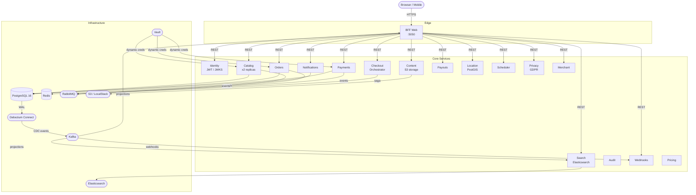

# Haworks Platform

A production-grade .NET 9 microservices platform built on Clean Architecture principles. Sixteen deployed services communicate via async messaging (MassTransit/RabbitMQ), Change Data Capture (Debezium/Kafka), and synchronous REST. Every service has its own PostgreSQL schema, transactional outbox/inbox, and Polly-backed resilience. The entire stack runs locally via .NET Aspire or Docker Compose and deploys to Fly.io through a fully automated CI/CD pipeline.

[](https://github.com/chidionyema/haworks-platform/actions/workflows/ci.yml)
[](https://github.com/chidionyema/haworks-platform/actions/workflows/deploy.yml)
[](https://dotnet.microsoft.com/)
[](LICENSE)

> **New here?** Start with **[docs/GETTING-STARTED.md](docs/GETTING-STARTED.md)** (zero-to-running in 5 minutes) or **[docs/INDEX.md](docs/INDEX.md)** (find any doc by role). To contribute, see **[CONTRIBUTING.md](CONTRIBUTING.md)**.

---

## Table of Contents

1. [Platform Overview](#1-platform-overview)
2. [Architecture](#2-architecture)
3. [Services](#3-services)
4. [Quick Start](#4-quick-start)
5. [Development](#5-development)
6. [Testing](#6-testing)
7. [CI/CD](#7-cicd)
8. [Security and Quality](#8-security-and-quality)
9. [Infrastructure](#9-infrastructure)
10. [Deployment](#10-deployment)

---

## 1. Platform Overview

Haworks is a marketplace platform for spiritual and ritual services. The backend is a distributed system of independently deployable .NET 9 microservices, each owning its own data store, schema migrations, and deployment unit.

### Core technology choices

| Concern | Technology |
|---|---|
| Runtime | .NET 9, ASP.NET Core Minimal APIs |
| Architecture | Clean Architecture (Domain / Application / Infrastructure / API) |
| Database | PostgreSQL 16 + EF Core 9, schema-per-service |
| Async messaging | MassTransit 8 + RabbitMQ, transactional outbox/inbox |
| Change Data Capture | Debezium Connect 3 → Kafka (topics: `db.{svc}.public.{table}`) |
| Auth | JWT via JWKS, Vault AppRole for service credentials |
| Secrets | HashiCorp Vault (dynamic DB credentials, AppRole) |
| Caching | Hybrid L1/L2 (in-process + Redis) |
| Search | Elasticsearch 8 |
| Object storage | S3-compatible (LocalStack locally, Fly Tigris in production) |
| Observability | OpenTelemetry traces → Grafana Tempo, Serilog structured logs |
| Resilience | Polly (retry, circuit breaker, bulkhead) |
| Local orchestration | .NET Aspire |
| Production hosting | Fly.io (per-service `fly.{svc}.toml`) |

---

## 2. Architecture

### System diagram



### Communication patterns

| Pattern | Used for |
|---|---|
| **Synchronous REST** | BFF → backing services, inter-service reads |
| **MassTransit / RabbitMQ** | Domain events, saga orchestration, transactional outbox/inbox |
| **Debezium CDC → Kafka** | Read-side projections (Search), webhook fan-out, BFF real-time feed |
| **JWKS** | Stateless JWT validation across all services |

### Active sagas

| Saga | Service | Stages |
|---|---|---|
| CheckoutSaga | CheckoutOrchestrator | Stock reservation → Payment → Order completion |
| RefundSaga | Payments | Provider refund → ledger update → notification |
| SubscriptionSaga | Payments | Renewal → dunning logic on failure |
| PrivacyRequestStateMachine | Privacy | GDPR erasure coordination across services |

---

## 3. Services

| Service | Purpose | Database | Notes |
|---|---|---|---|
| **BffWeb** | Backend-for-Frontend gateway for web clients | — | Aggregates all downstream services; consumes Kafka for real-time events |
| **Identity** | Authentication, user management, JWKS token issuer | `identity` | Issues JWTs; all other services validate via JWKS |
| **Catalog** | Product/service catalogue management | `catalog` | Runs x2 replicas; CDC via Debezium publishes to Kafka |
| **Orders** | Order lifecycle (create, fulfil, cancel) | `orders` | Transactional outbox; publishes `OrderPlaced`, `OrderCancelled` |
| **Payments** | Payment processing, refunds, subscriptions | `payments` | RefundSaga + SubscriptionSaga; Stripe provider abstraction |
| **CheckoutOrchestrator** | Saga coordinator for the checkout flow | `checkout` | CheckoutSaga: stock → payment → completion |
| **Content** | Media upload, CDN presigned URLs, virus scan | `content` | AWS S3 SDK; ClamAV integration for malware scanning |
| **Search** | Read-side product search | `elasticsearch` | Elasticsearch 8; consumes CDC events from Kafka |
| **Notifications** | Email, push, in-app notification delivery | `notifications` | Redis-backed deduplication; MassTransit consumer |
| **Audit** | Immutable audit log of platform events | `audit` | Append-only; receives events from all services via RabbitMQ |
| **Webhooks** | Outbound webhook delivery to merchant endpoints | `webhooks` | Consumes Kafka CDC events; retries with exponential backoff |
| **Payouts** | Merchant payout orchestration | `payouts` | Stripe Connect transfers; idempotent disbursement |
| **Location** | Geospatial queries (near-me, radius search) | `location` | PostGIS extension; PostGIS Testcontainer in tests |
| **Scheduler** | Cron-based job scheduling | `scheduler` | Quartz.NET-backed; fires domain events on schedule |
| **Privacy** | GDPR data erasure and access requests | `privacy` | PrivacyRequestStateMachine coordinates cross-service erasure |
| **Merchant** | Merchant onboarding and profile management | `merchant` | KYC state machine; links to Identity + Payouts |
| **Pricing** | Dynamic pricing rules and discount engine | — | No persistent DB; pure rule evaluation |
| **Contracts** | Shared event contracts (`IDomainEvent`) | — | Class library only; referenced by all services |
| **BuildingBlocks** | Shared infrastructure (Result monad, outbox, resilience) | — | `Haworks.BuildingBlocks` NuGet-style package |

---

## 4. Quick Start

### Prerequisites

| Tool | Minimum version |
|---|---|
| .NET SDK | 9.0 |
| Docker Desktop | 4.x (Docker Engine 24+) |
| .NET Aspire workload | `dotnet workload install aspire` |
| Git | any recent |

### Clone

```bash
git clone https://github.com/chidionyema/haworks-platform.git
cd haworks-platform
```

### Option A — .NET Aspire (recommended for development)

Aspire orchestrates every container and service with health-checked startup ordering, persistent volumes, and the Aspire dashboard for live logs and traces.

```bash
cd deploy/aspire
dotnet run
```

The Aspire dashboard opens at `http://localhost:15888`. All services are available within ~60 seconds on first run (containers are pulled once and reused on subsequent runs via `ContainerLifetime.Persistent`).

| Endpoint | URL |
|---|---|
| BFF Web (HTTP) | http://localhost:5050 |
| BFF Web (HTTPS) | https://localhost:5051 |
| Aspire Dashboard | http://localhost:15888 |
| pgAdmin | http://localhost:5050 (Aspire proxy) |
| Redis Commander | http://localhost:5050 (Aspire proxy) |
| RabbitMQ Management | http://localhost:5050 (Aspire proxy) |
| Pact Broker | http://localhost:9292 |
| Vault | http://localhost:8200 (dev token: `dev-root-token`) |

### Option B — Docker Compose

```bash
docker compose -f deploy/compose/docker-compose.yml up -d
dotnet run --project src/BffWeb/BffWeb.Api
```

### First request

```bash
# Health check
curl http://localhost:5050/health

# Get catalogue (unauthenticated browse)
curl http://localhost:5050/api/catalog/products
```

---

## 5. Development

### Project structure

```
haworks-platform/
  src/
    {Service}/
      {Service}.Domain/          # Entities, value objects, domain events
      {Service}.Application/     # Use cases, command/query handlers, DTOs
      {Service}.Infrastructure/  # EF Core, MassTransit consumers, Vault, S3
      {Service}.Api/             # ASP.NET Core host, DI wiring, Dockerfiles
    BuildingBlocks/              # Shared: Result<T>, outbox, resilience, JWKS
    BuildingBlocks.Testing/      # Shared Testcontainers singletons
    Contracts/                   # IDomainEvent, all cross-service event types
  tests/
    {Service}/
      {Service}.Unit/
      {Service}.Integration/
      {Service}.Architecture/
      {Service}.Contract/        # Pact consumer/provider tests
    E2E/                         # Playwright end-to-end tests
    Smoke/                       # Aspire-hosted smoke suite
  deploy/
    aspire/                      # .NET Aspire AppHost (Program.cs)
    fly/                         # bootstrap.sh, per-service fly.toml files
  deploy/compose/                 # docker-compose.yml
  scripts/                       # check-architecture.sh, seed-vault-dev.sh
  docs/                          # Extended documentation
  .github/workflows/             # CI, Deploy, Nightly, CodeQL, post-deploy scan
```

### Adding a new service

1. Create the four-layer project structure under `src/{NewService}/`.
2. Add a `DependencyInjection.cs` per layer with `Add{Layer}()` extension methods.
3. Register domain events in `src/Contracts/` implementing `IDomainEvent`.
4. Add a database entry in `deploy/aspire/Program.cs` (`postgres.AddDatabase("newsvc")`).
5. Add an integration test project under `tests/{NewService}/{NewService}.Integration/` using shared Testcontainers (see [Testing](#6-testing)).
6. Add the suite to the CI matrix in `.github/workflows/ci.yml`.
7. Create `fly.newsvc.toml` and add a deploy job to `.github/workflows/deploy.yml`.

### Coding conventions

- **Error handling**: use the `Result<T>` monad from `BuildingBlocks`. No raw exceptions in application layer.
- **Auth**: every controller that modifies state must carry `[Authorize]`. User identity is always sourced from the JWT claim, never from the request body.
- **Database**: EF Core 9 with explicit migrations. Each service owns its schema; no cross-schema joins.
- **Messaging**: produce events via the transactional outbox. Consume via MassTransit with idempotent handlers (check inbox before processing).
- **Resilience**: wrap all external HTTP calls in a Polly policy registered in the service's `DependencyInjection.cs`.
- **Observability**: use `ILogger<T>` with structured log properties. Propagate `TraceId`/`SpanId` via OpenTelemetry.

---

## 6. Testing

### Test pyramid

| Layer | Projects | Runner | What is tested |
|---|---|---|---|
| Unit | `{Service}.Unit` | `dotnet test` | Domain logic, application handlers, validators — no I/O |
| Architecture | `{Service}.Architecture`, `tests/Architecture` | `dotnet test` | Dependency rules (NetArchTest), raw Testcontainer violations |
| Contract (Pact) | `{Service}.Contract` | `dotnet test` + Pact Broker | Consumer-driven contracts between BFF and backing services |
| Integration | `{Service}.Integration` | `dotnet test` (Docker required) | Real Postgres, Elasticsearch, Kafka via shared Testcontainers |
| Smoke | `tests/Smoke` | `dotnet test` (Aspire) | Full-stack boot via Aspire AppHost; critical path HTTP checks |
| E2E | `tests/E2E` | Playwright | Browser-driven user journeys against the live stack |

### Shared Testcontainers (mandatory)

Integration tests must use the shared singleton containers from `BuildingBlocks.Testing.Containers`. Never instantiate raw `PostgreSqlBuilder` or `ContainerBuilder` — the architecture check enforces this and CI will fail.

```csharp
// Correct
var db = await SharedTestPostgres.CreateDatabaseAsync("catalog");
var es = await SharedTestElasticsearch.GetConnectionAsync("search");
var pgis = await SharedTestPostGIS.CreateDatabaseAsync("location");

// Wrong — will fail CI architecture check
var container = new PostgreSqlBuilder().Build();
```

Containers use `WithReuse(true)` — one Docker container per type is shared across all test runs on a machine.

### Running tests locally

```bash
# All unit tests
dotnet test HaworksPlatform.sln --filter "Category=Unit"

# All architecture tests
dotnet test HaworksPlatform.sln --filter "Category=Architecture"

# Single service integration tests (requires Docker)
dotnet test tests/Catalog/Catalog.Integration/Catalog.Integration.csproj

# All integration tests
find tests -name '*.Integration.csproj' | xargs -I{} dotnet test {}

# Smoke tests (requires Aspire / full stack)
dotnet test tests/Smoke/Smoke.csproj

# E2E tests (requires Playwright browsers installed)
pwsh tests/E2E/bin/Debug/net9.0/playwright.ps1 install --with-deps
dotnet test tests/E2E/E2E.csproj -e E2E_ENABLED=1

# Architecture enforcement script
./scripts/check-architecture.sh
```

---

## 7. CI/CD

### CI pipeline (`.github/workflows/ci.yml`)

Triggers on every push to `main` and every pull request targeting `main`.

```
build-and-fast-tests          (~2 min)
  ├── Restore + Release build
  ├── Unit tests (all services)
  ├── Architecture tests (all services)
  └── Contract / Pact tests (all services)

integration-tests             (~8 min, parallel matrix)
  ├── Catalog.Integration
  ├── Orders.Integration
  ├── Payments.Integration
  ├── Identity.Integration
  ├── BffWeb.Integration
  ├── CheckoutOrchestrator.Integration
  ├── Content.Integration
  ├── Search.Integration
  ├── Audit.Integration
  ├── Notifications.Integration
  ├── Webhooks.Integration
  ├── Payouts.Integration
  └── Scheduler.Integration

smoke-and-e2e                 (workflow_dispatch only)
  ├── Aspire AppHost boot
  ├── Smoke tests
  └── E2E tests (Playwright)
```

Docker images for Testcontainers (Postgres 16, Elasticsearch 8.17, Kafka 7.6, RabbitMQ 3) are cached between runs to avoid repeated pulls.

### Deploy pipeline (`.github/workflows/deploy.yml`)

Triggers automatically after CI passes on `main`, or manually from the Actions tab.

- **Path filtering**: each deploy job checks whether the service's source files changed. A single-service fix deploys only that service (~90 s vs ~7 min for a full roll).
- **Manual dispatch** (`workflow_dispatch`): always deploys everything regardless of changed paths. Use the `force_all` input to override.
- **Vault bootstrap**: the pipeline captures Vault init keys and AppRole credentials, stages them as Fly secrets on Identity, then rolls all backends and the BFF.

### Triggering deployments

```bash
# Automatic — push to main after CI passes
git push origin main

# Manual full redeploy
gh workflow run deploy.yml -f force_all=true

# Manual with vault keys already staged
gh workflow run deploy.yml -f bypass_vault_capture=true
```

### Nightly scan (`.github/workflows/nightly.yml`)

Runs at 2:00 AM UTC every day. See [Security and Quality](#8-security-and-quality) for details.

---

## 8. Security and Quality

The platform runs six automated workflows that continuously scan from code commit through to the live deployed site. Full details are in [docs/AUTOMATED-SCANNING.md](docs/AUTOMATED-SCANNING.md).

| Workflow | Trigger | What it covers |
|---|---|---|
| **CodeQL** | Every PR, push to main, nightly | Static analysis: SQL injection, XSS, SSRF, path traversal |
| **Dependabot** | Weekly (Monday) | NuGet CVE detection + automated update PRs |
| **Nightly Scan** | 2 AM UTC daily, manual | Dependency audit, architecture enforcement, full integration suite, Gitleaks secret scan, Claude deep code review |
| **Claude PR Review** | Every PR open/update | AI review: auth gaps, IDOR, financial math, race conditions, missing tests |
| **Post-Deploy Scan** | After every deploy, manual | OWASP ZAP pentest, Nuclei CVE scan, auth/IDOR probes, Claude live attack simulation |
| **CI** | Every PR, push to main | Build, unit, architecture, contract, integration tests |

### Required secrets

```bash
# Enable Claude-powered workflows
gh secret set ANTHROPIC_API_KEY
```

### Viewing results

| Result | Location |
|---|---|
| CodeQL alerts | GitHub → Security → Code scanning alerts |
| Dependabot PRs | GitHub → Pull requests (author: dependabot) |
| Nightly findings | GitHub → Issues (label: `nightly-audit`) |
| Post-deploy findings | GitHub → Issues (label: `exploratory-scan`) |
| ZAP / Nuclei reports | GitHub → Actions → run → Artifacts |

---

## 9. Infrastructure

All infrastructure runs as persistent Docker containers locally (Aspire reattaches on restart without re-pulling or re-initialising). In production each stateful dependency is a managed service or a persistent Fly volume.

| Component | Local (Aspire) | Purpose |
|---|---|---|
| **PostgreSQL 16** | `postgres:16-alpine`, persistent volume | Primary data store for all services. WAL configured for CDC (`wal_level=logical`, 10 replication slots). |
| **Redis** | `redis:latest`, persistent volume | L2 cache for Notifications deduplication and hybrid cache |
| **RabbitMQ 3** | `rabbitmq:3-management`, Management UI | MassTransit transport for domain events and saga messages |
| **Kafka** | `confluentinc/cp-kafka:7.6.1`, persistent volume | CDC event stream from Debezium; consumed by Search, BffWeb, Webhooks |
| **Debezium Connect 3** | `debezium/connect:3.0` | Reads Postgres WAL, writes change events to Kafka topics |
| **Elasticsearch 8** | `elasticsearch:8.17.0`, persistent volume | Full-text search index; populated by Search service via Kafka |
| **HashiCorp Vault 1.15** | `hashicorp/vault:1.15`, dev mode | Dynamic DB credentials, AppRole secrets for all services |
| **LocalStack 3** | `localstack/localstack:3`, S3 only | S3-compatible object storage for Content service (Fly Tigris in prod) |
| **ClamAV** | `clamav/clamav:latest` | Antivirus scanning for file uploads in Content service |
| **Grafana Tempo** | `grafana/tempo:latest` | Distributed trace backend; receives OTLP from all services |
| **Pact Broker** | `pactfoundation/pact-broker` | Stores and verifies consumer-driven contract pacts |
| **pgAdmin** | Aspire plugin | Postgres GUI |
| **Redis Commander** | Aspire plugin | Redis GUI |

### Vault credential flow

1. `vault-init` container bootstraps Vault with AppRole auth and the database secrets engine.
2. `vault-seed` writes per-service `role_id` and `secret_id` files to `deploy/aspire/vault-creds/{svc}/`.
3. Each service reads its credentials at startup via `Vault__RoleIdPath` / `Vault__SecretIdPath` environment variables and exchanges them for a short-lived Vault token that fetches dynamic Postgres credentials.

### Kafka topics (CDC)

Topics are named `db.{service}.public.{table}`, e.g. `db.catalog.public.products`. Connectors are registered from JSON files in `deploy/aspire/debezium/` on first boot.

---

## 10. Deployment

### Local — .NET Aspire

```bash
cd deploy/aspire
dotnet run
# Dashboard: http://localhost:15888
# BFF: http://localhost:5050
```

Containers declared with `ContainerLifetime.Persistent` survive `Ctrl+C` and are reattached on the next `dotnet run` without re-initialisation.

### Local — Docker Compose

```bash
# Start all infrastructure
docker compose -f deploy/compose/docker-compose.yml up -d

# Run a single service
dotnet run --project src/Catalog/Catalog.Api

# Run all services (requires foreman or similar)
dotnet run --project src/BffWeb/BffWeb.Api
```

### Production — Fly.io

Each service has its own `fly.{svc}.toml` in the repo root, all deploying from the repo root build context so `Directory.Build.props` and shared `BuildingBlocks`/`Contracts` projects are available to the Dockerfile.

#### First-time setup

```bash
# Copy and fill in three URLs: RABBITMQ_URL, REDIS_URL, POSTGRES_BASE
cp .env.example .env.local

# Create Fly apps, volumes, and stage non-Vault secrets (run once)
./deploy/fly/bootstrap.sh
```

#### Per-service manual deploy

```bash
flyctl deploy -c fly.bffweb.toml
flyctl deploy -c fly.catalog.toml
flyctl deploy -c fly.identity.toml
# etc.
```

#### Push-driven deploy (normal workflow)

```bash
git push origin main
# CI runs → on success, Deploy workflow fires automatically
# Path filtering deploys only changed services
```

#### Production regions

The primary region is `iad` (Washington, D.C.). Additional regions can be added per service in the respective `fly.{svc}.toml` via the `[env]` and `[[regions]]` stanzas.

---

## Contributing

See **[CONTRIBUTING.md](CONTRIBUTING.md)** for the full guide: PR workflow, coding conventions, testing rules, pre-push checklist, and common pitfalls.

---

## License

MIT — see [LICENSE](LICENSE).
