# Haworks Platform — High-Level Design

**Version:** 1.0
**Date:** 2026-05-14
**Status:** Living Document

---

## Table of Contents

1. [System Context](#1-system-context)
2. [Architecture Style](#2-architecture-style)
3. [Service Catalog](#3-service-catalog)
4. [Communication Patterns](#4-communication-patterns)
5. [Saga Orchestrations](#5-saga-orchestrations)
6. [Data Architecture](#6-data-architecture)
7. [Security Architecture](#7-security-architecture)
8. [Resilience](#8-resilience)
9. [Observability](#9-observability)
10. [Infrastructure](#10-infrastructure)

---

## 1. System Context

Haworks is a multi-sided e-commerce and content marketplace. It connects **buyers** who discover and purchase spiritual / ritual goods and services with **sellers** (merchants) who list products, manage inventory, and receive payouts. **Platform administrators** manage compliance, GDPR erasure requests, audit trails, and operational concerns.

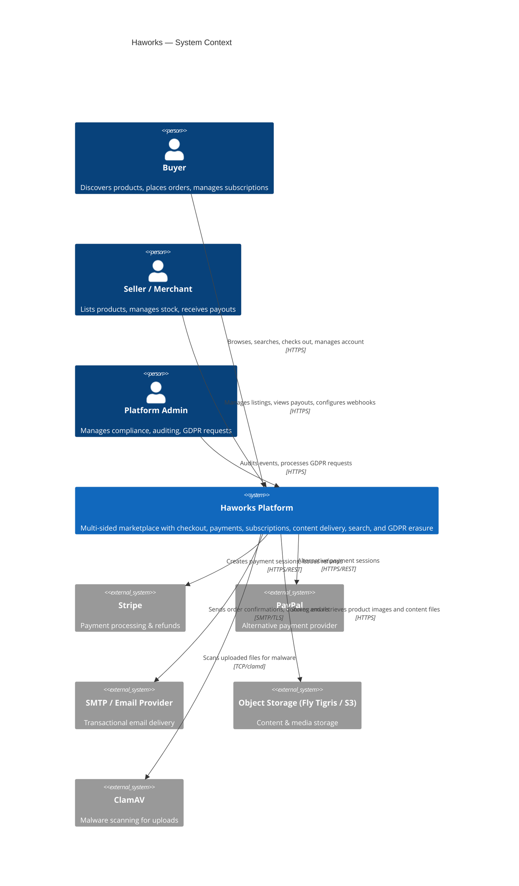

---

## 2. Architecture Style

### 2.1 Microservices

The platform is decomposed into 16 independently deployable services. Each service owns its data, is deployed as its own process, and communicates with peers via well-defined contracts. There is no shared database between services.

### 2.2 Clean Architecture Layers

Every service follows the same four-layer structure:

```
{Service}.Domain          — Aggregates, entities, value objects, domain events, domain interfaces
{Service}.Application     — Use cases, commands/queries (CQRS), saga state machines, validators
{Service}.Infrastructure  — EF Core DbContext, repositories, MassTransit consumers, external adapters
{Service}.Api             — ASP.NET Core minimal API / controller endpoints, DI composition root
```

Dependencies flow strictly inward: `Api → Application → Domain`. Infrastructure implements domain interfaces, never the reverse.

### 2.3 Domain-Driven Design Bounded Contexts

```mermaid
graph TD
    subgraph Identity["Identity BC"]
        id_agg["User Aggregate\nCredentials · JWKS"]
    end
    subgraph Catalog["Catalog BC"]
        cat_agg["Product Aggregate\nCategory · Stock · Pricing"]
    end
    subgraph Orders["Orders BC"]
        ord_agg["Order Aggregate\nLineItems · Status"]
    end
    subgraph Payments["Payments BC"]
        pay_agg["Payment Aggregate\nSession · Refund · Subscription"]
    end
    subgraph Checkout["Checkout Orchestrator BC"]
        co_agg["CheckoutSaga State\n(coordination only)"]
    end
    subgraph Content["Content BC"]
        con_agg["Content Item\nMedia · S3 Ref · Virus Scan"]
    end
    subgraph Merchant["Merchant BC"]
        mer_agg["Merchant Profile\nStore · Onboarding"]
    end
    subgraph Payouts["Payouts BC"]
        po_agg["Payout Aggregate\nLedger · Provider Transfer"]
    end
    subgraph Notifications["Notifications BC"]
        not_agg["Notification\nEmail · In-App · Channel Prefs"]
    end
    subgraph Search["Search BC (Read-side)"]
        se_agg["Product Index\nElasticsearch Projection"]
    end
    subgraph Webhooks["Webhooks BC"]
        wh_agg["Subscription · Delivery Log"]
    end
    subgraph Audit["Audit BC"]
        au_agg["Audit Event\nImmutable Log"]
    end
    subgraph Scheduler["Scheduler BC"]
        sc_agg["Scheduled Job\nRecurring Trigger"]
    end
    subgraph Location["Location BC"]
        loc_agg["Geospatial Point\nPostGIS"]
    end
    subgraph Privacy["Privacy BC"]
        pr_agg["Privacy Request\nGDPR Erasure State"]
    end
    subgraph Pricing["Pricing BC"]
        pri_agg["Price Rule\nDiscount · Tax"]
    end
```

### 2.4 CQRS

Commands mutate state via the Application layer's command handlers (validated with FluentValidation). Queries are handled separately, often projecting directly from the read model. The Search service is a pure read-side projection with no write path of its own.

### 2.5 Error Handling

The `Result<T>` monad (railway-oriented programming) is used throughout the Application layer. Handlers return `Result<T>` rather than throwing; the API layer translates failures to appropriate HTTP status codes using a `ProblemDetails` response.

---

## 3. Service Catalog

| Service | Responsibility | DB Schema | Key Domain Entities |
|---|---|---|---|
| **Identity** | Authentication, user registration, JWKS key management, token issuance | `identity` | User, RefreshToken, JwksKey |
| **Catalog** | Product listings, categories, stock management | `catalog` | Product, Category, StockItem |
| **Orders** | Order lifecycle, line items, order status transitions | `orders` | Order, OrderLineItem, OrderStatus |
| **Payments** | Payment sessions, refunds (RefundSaga), subscriptions (SubscriptionSaga), provider webhooks | `payments` | Payment, RefundSagaState, SubscriptionSagaState |
| **CheckoutOrchestrator** | Cross-service checkout choreography via CheckoutSaga | `checkout` | CheckoutSagaState |
| **Content** | Product media and file management, virus scanning, S3-backed presigned URLs | `content` | ContentItem, ContentType |
| **Merchant** | Merchant profiles, store settings, onboarding status | `merchant` | Merchant, MerchantStore |
| **Payouts** | Seller payout ledger, provider transfers | `payouts` | Payout, PayoutLineItem |
| **Notifications** | Email and in-app notifications, channel preferences, delivery tracking | `notifications` | Notification, NotificationChannel |
| **Search** | Read-side Elasticsearch product index; consumes CDC events from Kafka | — (Elasticsearch) | ProductDocument |
| **Webhooks** | Webhook subscription management, outbound delivery, retry, HMAC signing | `webhooks` | WebhookSubscription, DeliveryAttempt |
| **Audit** | Immutable platform audit log; stores domain events from all services | `audit` | AuditEvent |
| **Scheduler** | Cron-based and delay-based job scheduling, publishes trigger events | `scheduler` | ScheduledJob |
| **Location** | Geospatial data (PostGIS), merchant/event coordinates, geo-search | `location` | GeoPoint, LocationRecord |
| **Privacy** | GDPR erasure request state machine, cross-service coordination | `privacy` | PrivacyRequestState |
| **Pricing** | Price rules, discount codes, tax computation | — (stateless rules engine) | PriceRule, DiscountCode |
| **BFF (Web)** | Backend-for-Frontend — aggregates, caches, and proxies to all backend services; consumes CDC for cache invalidation | — | — |

### Replica Strategy

`catalog-svc` runs with 2 replicas behind Aspire's reverse proxy to demonstrate horizontal scaling. The BFF round-robins across replicas; each replica stamps `X-Instance-Id` on responses to make load distribution observable.

---

## 4. Communication Patterns

### 4.1 Synchronous — REST via BFF

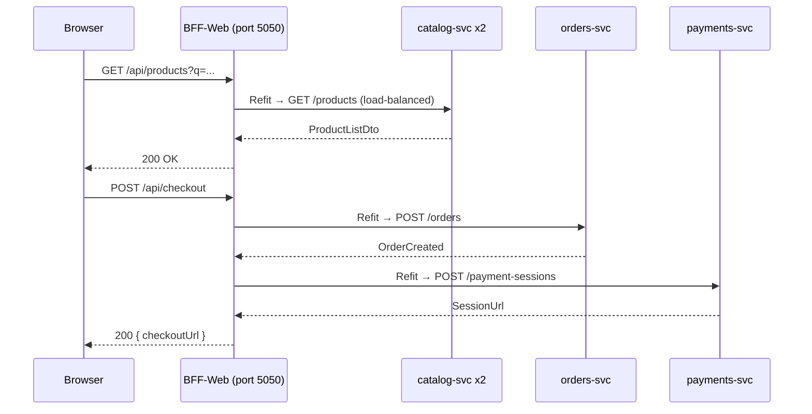

All inter-service HTTP calls use **Refit** typed clients. Every service validates JWT via JWKS — the `JwksUri` is injected from Identity's runtime endpoint at startup. No service-to-service call bypasses authentication.

### 4.2 Asynchronous — MassTransit + RabbitMQ

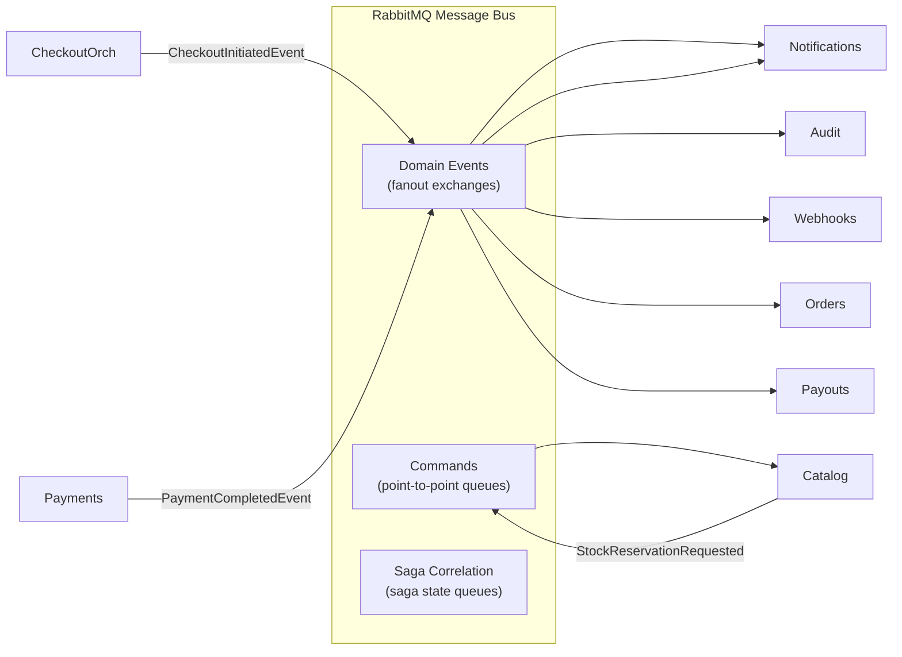

**MassTransit** mediates all bus interactions:
- **Transactional Outbox**: domain events are written to the service's own database in the same transaction as the aggregate change, then relayed to RabbitMQ by a background `OutboxRelay` — guaranteeing at-least-once delivery without distributed transactions.
- **Transactional Inbox**: consumers write a deduplication record in the same transaction as state mutation — guaranteeing idempotent processing of redelivered messages.
- **Bounded Context Consumer Definitions**: each service registers its consumers with a `BoundedContextConsumerDefinition` that sets queue names, retry policies, and concurrency limits.

#### Event Contracts

All events implement `IDomainEvent` from `Haworks.Contracts`. Key event namespaces:

| Namespace | Events |
|---|---|
| `Contracts.Catalog` | `CategoryUpdatedEvent`, `ProductCacheInvalidatedEvent`, `StockReservation*`, `StockRelease*` |
| `Contracts.Orders` | `OrderCreatedEvent`, `OrderCompletedEvent`, `OrderAbandonedEvent` |
| `Contracts.Payments` | `PaymentSessionCreatedEvent`, `PaymentCompletedEvent`, `PaymentAmountMismatchEvent`, `RefundIssuedEvent`, `Subscription*` |
| `Contracts.Checkout` | `CheckoutInitiatedEvent`, `PaymentExpiredEvent` |
| `Contracts.Privacy` | `PrivacyErasureRequested`, `PrivacyErasureCompleted` |
| `Contracts.Identity` | `UserProfileChangedEvent`, `VaultRotationStageEvent` |

### 4.3 Change Data Capture — Debezium → Kafka

CDC provides a zero-coupling integration path: services publish changes by writing to their own database; downstream consumers react without the source service knowing they exist.

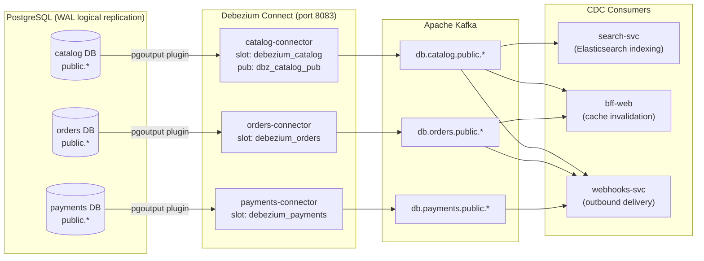

**Connector configuration** (example — catalog):
- `connector.class`: `io.debezium.connector.postgresql.PostgresConnector`
- `plugin.name`: `pgoutput`
- `snapshot.mode`: `initial`
- Topic pattern: `db.catalog.public.{table}`
- Serialization: JSON (no schema registry)

Connectors are registered via `debezium-init` (a one-shot `curlimages/curl` container) that POSTs each `*.json` config from `deploy/aspire/debezium/` to the Debezium Connect REST API at startup.

---

## 5. Saga Orchestrations

All sagas use **MassTransit StateMachine** (`MassTransitStateMachine<TState>`) with state persisted to PostgreSQL via EF Core. Each saga correlates events by a stable `CorrelationId` (saga ID). Scheduled timeouts use MassTransit's built-in `Schedule<TState, TMessage>` which persists the timer token in the saga state row.

### 5.1 CheckoutSaga

**Owner:** `checkout-orchestrator-svc`
**Purpose:** Orchestrates stock reservation → payment session creation → payment completion with full compensation on any failure path.

```mermaid
stateDiagram-v2
    [*] --> Initiated : CheckoutInitiatedEvent\npublish StockReservationRequested

    Initiated --> StockReserved : StockReservedEvent\npublish PaymentSessionRequested\nstart 15-min PaymentExpiry timer
    Initiated --> Abandoned : StockReservationFailedEvent\n(no stock to release)

    StockReserved --> ReadyForPayment : PaymentSessionCreatedEvent
    StockReserved --> Abandoned : PaymentSessionFailedEvent\npublish StockReleaseRequested\ncancel timer
    StockReserved --> Abandoned : PaymentExpiry timeout\npublish StockReleaseRequested + CheckoutSessionExpiredEvent

    ReadyForPayment --> Completed : PaymentCompletedEvent\ncancel timer
    ReadyForPayment --> Abandoned : PaymentSessionFailedEvent\npublish StockReleaseRequested\ncancel timer
    ReadyForPayment --> Abandoned : PaymentExpiry timeout\npublish StockReleaseRequested + CheckoutSessionExpiredEvent
    ReadyForPayment --> RequiresReview : PaymentAmountMismatchEvent\n(ops review; no auto-compensation)

    Completed --> [*]
    Abandoned --> [*]
    RequiresReview --> [*]
```

**Key design decisions:**
- The saga holds _only_ orchestration state (IDs, serialized line items, failure reason). Business state remains authoritative in Orders and Payments aggregates.
- The 15-minute `PaymentExpirySchedule` fires `PaymentExpiredEvent` which triggers the same compensation path as `PaymentSessionFailedEvent`.
- Late-arriving duplicate events on finalized states are silently discarded (`DuringAny` guards).

### 5.2 RefundSaga

**Owner:** `payments-svc`
**Purpose:** Orchestrates provider-side refund initiation → confirmation with a 24-hour timeout for stalled refunds.

```mermaid
stateDiagram-v2
    [*] --> Requested : RefundRequestedEvent\npublish ProviderRefundInitiationRequested\nstart 24-hr timeout

    Requested --> AwaitingProviderConfirmation : ProviderRefundInitiatedEvent\n(provider accepted)
    Requested --> RequiresReview : ProviderRefundFailedEvent\npublish RefundFailedEvent\ncancel timeout

    AwaitingProviderConfirmation --> Refunded : ProviderRefundSucceededEvent\npublish RefundCompletedEvent\ncancel timeout
    AwaitingProviderConfirmation --> RequiresReview : ProviderRefundFailedEvent\npublish RefundFailedEvent\ncancel timeout
    AwaitingProviderConfirmation --> RequiresReview : 24-hr timeout\npublish RefundStalledEvent

    Refunded --> [*]
    Cancelled --> [*]

    note right of AwaitingProviderConfirmation : DuringAny: RefundCancelledByOperator\n→ Cancelled (publishes cancellation to provider\nif in AwaitingProviderConfirmation)
```

### 5.3 SubscriptionSaga

**Owner:** `payments-svc`
**Purpose:** Manages the full subscription lifecycle — renewal scheduling, grace period, and dunning with up to 3 retry attempts before cancellation.

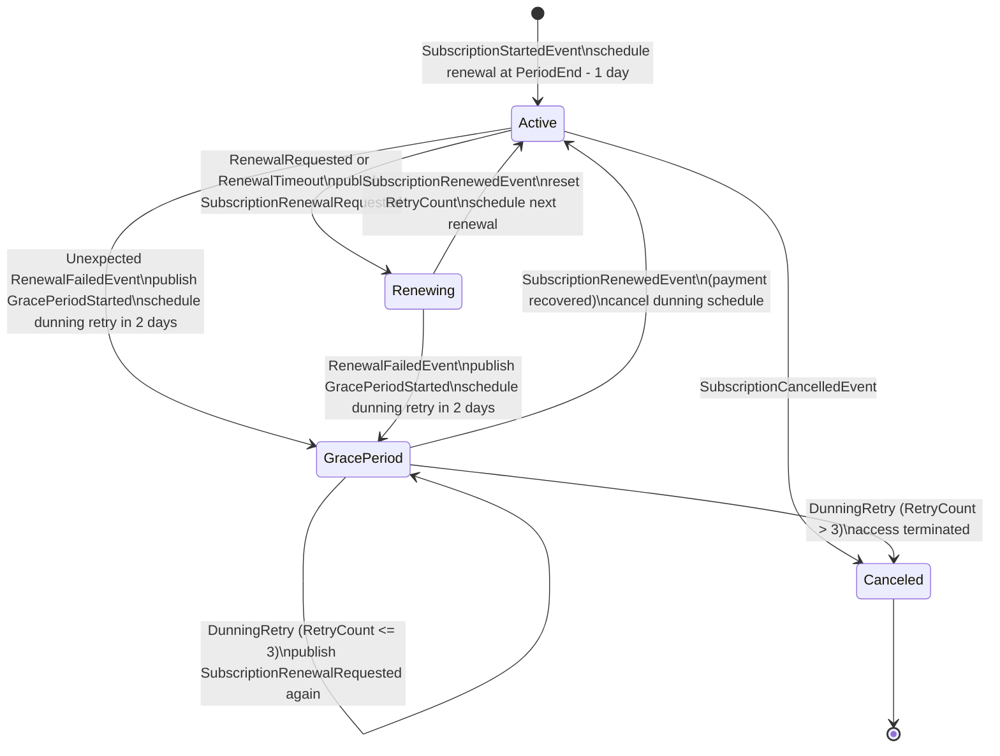

**Dunning logic:** up to 3 retry attempts spaced 2 days apart. On exhaustion, the subscription transitions to `Canceled` and access is terminated.

### 5.4 PrivacyRequestStateMachine

**Owner:** `privacy-svc`
**Purpose:** Coordinates GDPR Right-to-Erasure across multiple services. The saga fans out a `PrivacyErasureRequested` event and waits for confirmation from each participating service before marking the request complete.

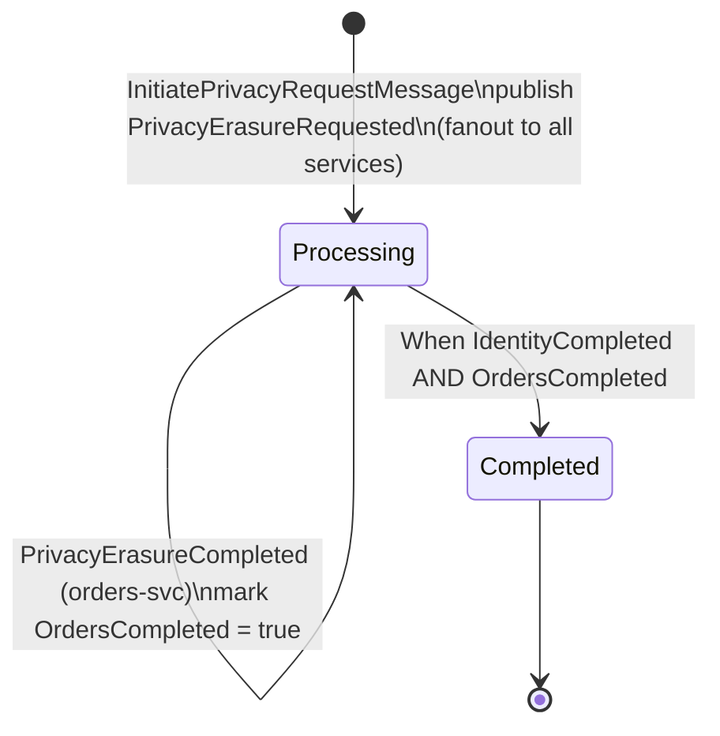

**Participants:** `identity-svc` (user account anonymisation) and `orders-svc` (order PII redaction). Additional services join by consuming `PrivacyErasureRequested` and publishing `PrivacyErasureCompleted` with their `ServiceName`.

---

## 6. Data Architecture

### 6.1 Schema-per-Service Isolation

Each service owns a distinct PostgreSQL _database_ (not schema) provisioned at startup:

| Database | Owner Service |
|---|---|
| `identity` | Identity |
| `catalog` | Catalog |
| `orders` | Orders |
| `payments` | Payments |
| `checkout` | CheckoutOrchestrator |
| `content` | Content |
| `notifications` | Notifications |
| `audit` | Audit |
| `location` | Location (PostGIS) |
| `webhooks` | Webhooks |
| `payouts` | Payouts |
| `scheduler` | Scheduler |
| `privacy` | Privacy |
| `merchant` | Merchant |

No service may connect to another service's database. Cross-service data access is exclusively via events or API calls.

### 6.2 EF Core 9 Migrations

Each service's `Infrastructure` project owns its own `DbContext` and migration history. Database schema evolution is applied via `DatabaseMigrationExtensions.MigrateAsync()` at service startup, guarded by a distributed lock to prevent concurrent migration races in multi-replica deployments.

### 6.3 Vault Dynamic Credentials

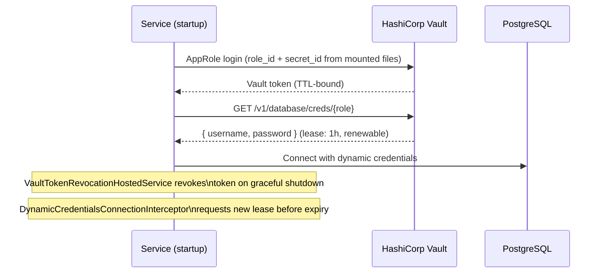

`VaultConfigBootstrap` seeds Vault paths at startup. `VaultAppRoleAuthenticator` exchanges AppRole credentials for a Vault token. `DynamicCredentialsConnectionInterceptor` (EF Core interceptor) transparently rotates database credentials before each connection open if the lease is near expiry.

### 6.4 Transactional Outbox / Inbox

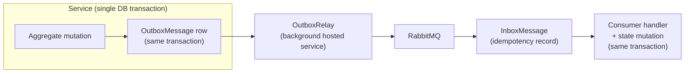

This guarantees **exactly-once semantics at the application level**: an event is never lost between database commit and message publication, and duplicate deliveries are deduplicated by the inbox.

### 6.5 Object Storage

The `content-svc` stores binary content (images, documents) in S3-compatible object storage (Fly Tigris in production, LocalStack in development). It returns presigned URLs directly to clients, keeping binary traffic off the application tier. Uploaded files are scanned by **ClamAV** before the presigned URL is activated.

---

## 7. Security Architecture

### 7.1 Authentication — JWT via JWKS

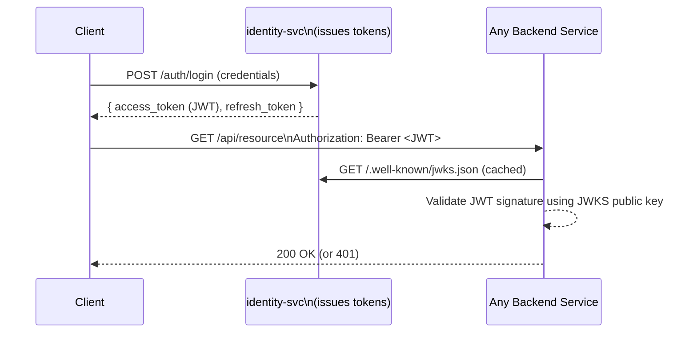

- `identity-svc` issues RS256 JWTs and exposes a JWKS endpoint.
- Every backend service uses `AddJwksAuthentication()` which fetches and caches the public key set. The JWKS URI is injected at startup from Identity's runtime endpoint (`Authentication__Jwks__JwksUri`).
- `VaultJwtSigningKeyProvider` allows the signing key to be rotated via Vault without restarting `identity-svc` — a `VaultRotationStageEvent` triggers in-flight key rotation across the cluster.

### 7.2 Service Credentials — Vault AppRole

Each service is assigned a Vault AppRole with its `role_id` and `secret_id` mounted as files. No secrets are baked into environment variables or container images. The `vault-init` container provisions roles and policies at startup; `vault-seed` populates development seed data.

### 7.3 API Security Controls

| Control | Implementation |
|---|---|
| **CSRF protection** | Double-submit cookie pattern on state-mutating endpoints |
| **CORS** | Per-service policy restricting allowed origins to BFF/known clients |
| **Rate limiting** | ASP.NET Core rate limiting middleware (sliding window per IP + per user) |
| **Input validation** | FluentValidation in the Application layer; model binding validation in the API layer |
| **Content scanning** | ClamAV integration in `content-svc` before file activation |
| **HTTPS** | TLS terminated at the BFF; all inter-service calls within the cluster use HTTP with mTLS planned for production |

---

## 8. Resilience

### 8.1 Polly Policies

The `BuildingBlocks.Resilience` library provides a `ResiliencePolicyFactory` that composes the following Polly strategies for all outbound HTTP and database calls:

| Strategy | Configuration |
|---|---|
| **Retry** | Exponential backoff with jitter; 3 attempts by default |
| **Circuit Breaker** | Opens after 5 consecutive failures; half-open probe after 30 s |
| **Bulkhead** | Per-dependency concurrency limit (default: 10 concurrent) |
| **Timeout** | Per-request timeout (default: 10 s); wraps inner retry pipeline |

### 8.2 Hybrid Cache (L1 / L2)

`BuildingBlocks.Caching.HybridCache` implements a two-level cache:

- **L1 (in-process):** `IMemoryCache` — nanosecond access, local to one replica.
- **L2 (distributed):** Redis — shared across all replicas of a service, with configurable TTL.

Cache population follows cache-aside; invalidation is triggered by CDC events (`ProductCacheInvalidatedEvent` from the Catalog Debezium topic) consumed by `bff-web`.

### 8.3 Health Checks

Every service registers ASP.NET Core health checks for:
- PostgreSQL connectivity
- RabbitMQ connectivity
- Redis connectivity (where applicable)
- Elasticsearch connectivity (Search service)
- Vault reachability

Aspire's resource health dashboard aggregates `/health` and `/alive` endpoints. Unhealthy replicas are removed from the load balancer before traffic is routed to them.

### 8.4 Message Relay Pause Gate

`RelayPauseGate` / `RelayPauseFilter` in `BuildingBlocks.Messaging` allows the outbox relay to be paused during rolling deployments or circuit breaker open periods, preventing cascading failures from message storms.

---

## 9. Observability

### 9.1 Distributed Tracing — OpenTelemetry + Tempo

Every service exports OTLP traces to **Grafana Tempo** (`OTEL_EXPORTER_OTLP_ENDPOINT` → `tempo:4317`). Trace context is propagated across:
- HTTP calls (via `HttpClient` instrumentation)
- MassTransit message headers (W3C Trace Context)
- EF Core queries (via `DbCommandInterceptor`)

Sagas emit discrete spans at key transitions. For example, `CheckoutSaga` emits a `checkout.saga.compensate` span with `saga.id`, `order.id`, and `compensate.reason` tags on every compensation entry, making failure forensics queryable in Tempo without log scraping.

### 9.2 Structured Logging — Serilog

All services use **Serilog** with structured JSON output. Every log entry carries:
- `correlationId` — injected by `CorrelationIdMiddleware` from the incoming `X-Correlation-Id` header (or generated if absent)
- `userId` — extracted from the JWT claim
- `serviceName` — set at bootstrapping

Log enrichment is provided by `BuildingBlocks.Telemetry.ITelemetryService`.

### 9.3 Correlation IDs

`X-Correlation-Id` is generated at the BFF on the first request and propagated to all downstream service calls via `HttpClient` DelegatingHandler. The same ID appears in logs, traces, and error responses, enabling end-to-end request tracing across service boundaries.

### 9.4 Observability Stack

| Component | Role |
|---|---|
| **Grafana Tempo** | Distributed trace storage and query |
| **OpenTelemetry SDK** | Instrumentation and OTLP export |
| **Serilog** | Structured log aggregation |
| **Aspire Dashboard** | Local dev — live resource health, log streaming, trace viewer |

---

## 10. Infrastructure

### 10.1 Deployment Topology

```mermaid
graph TB
    subgraph Internet
        client["Browser / Mobile Client"]
    end

    subgraph Platform["Haworks Platform"]
        subgraph BFF["BFF Tier"]
            bff["bff-web\n:5050 (HTTP)\n:5051 (HTTPS)"]
        end

        subgraph AppServices["Application Services"]
            identity["identity-svc"]
            catalog["catalog-svc x2"]
            orders["orders-svc"]
            payments["payments-svc"]
            checkout["checkout-svc"]
            content["content-svc"]
            search["search-svc"]
            notifications["notifications-svc"]
            audit["audit-svc"]
            webhooks["webhooks-svc"]
            payouts["payouts-svc"]
            location["location-svc"]
            scheduler["scheduler-svc"]
            privacy["privacy-svc"]
            merchant["merchant-svc"]
        end

        subgraph MessageBus["Message Bus"]
            rabbitmq["RabbitMQ\n:5672 (AMQP)\n:15672 (Mgmt)"]
            kafka["Apache Kafka\n:9092"]
        end

        subgraph CDC["Change Data Capture"]
            debezium["Debezium Connect\n:8083"]
            debezium_init["debezium-init\n(one-shot config)"]
        end

        subgraph DataStores["Data Stores"]
            postgres["PostgreSQL 16\n:5432\n14 databases\nwal_level=logical"]
            redis["Redis 7\n:6379"]
            elasticsearch["Elasticsearch\n:9200"]
        end

        subgraph SecretsMgmt["Secrets & Identity"]
            vault["HashiCorp Vault\n:8200"]
            vault_init["vault-init\n(one-shot)"]
            vault_seed["vault-seed\n(one-shot dev data)"]
        end

        subgraph ObjectStorage["Object Storage"]
            localstack["LocalStack S3\n:4566 (dev)\nor Fly Tigris (prod)"]
        end

        subgraph Malware["Security Scanning"]
            clamav["ClamAV\n:3310"]
        end

        subgraph Observability["Observability"]
            tempo["Grafana Tempo\n:4317 (OTLP)\n:3200 (HTTP)"]
        end

        subgraph Testing["Contract Testing"]
            pactbroker["Pact Broker\n:9292"]
        end
    end

    subgraph ExternalProviders["External Providers"]
        stripe_ext["Stripe"]
        paypal_ext["PayPal"]
        smtp_ext["SMTP"]
        s3_ext["Fly Tigris / S3 (prod)"]
    end

    client --> bff
    bff --> identity & catalog & orders & payments & checkout & content & search & notifications & audit & webhooks & payouts & location & scheduler & privacy & merchant
    bff --> rabbitmq & kafka

    identity & catalog & orders & payments & checkout & content & notifications & audit & webhooks & payouts & location & scheduler & privacy & merchant --> rabbitmq
    search & webhooks --> kafka
    debezium --> kafka
    postgres -->|WAL replication| debezium
    debezium_init -.->|registers connector configs| debezium

    identity & catalog & orders & payments & checkout & content & notifications & audit & webhooks & payouts & location & scheduler & privacy & merchant --> postgres
    notifications --> redis
    search --> elasticsearch
    content --> localstack
    content --> clamav

    payments --> stripe_ext & paypal_ext
    notifications --> smtp_ext
    content -.->|prod| s3_ext

    vault_init -.->|provisions AppRoles| vault
    vault_seed -.->|seeds dev data| vault
    vault_init --> postgres

    identity & catalog & orders & payments & checkout & content & notifications & audit & webhooks & payouts & location & scheduler & privacy & merchant -.->|OTLP traces| tempo
    bff -.->|OTLP traces| tempo
```

### 10.2 Aspire Orchestration

.NET Aspire (`deploy/aspire/Program.cs`) is used for local development and CI orchestration. It:

- Declares all infrastructure containers with `ContainerLifetime.Persistent` — containers survive across `dotnet run` cycles without full teardown/reinitialisation.
- Injects runtime-resolved service URLs (e.g., JWKS URI, Catalog base address) via `WithEnvironment` callbacks evaluated at start time.
- Sequences startup using `.WaitFor()` / `.WaitForCompletion()` to enforce dependency ordering (Vault seed → services; Debezium Connect → connector init).
- Streams all resource logs to `logs/{resourceId}.log` via the `ResourceFileLogger` hosted service.

### 10.3 Docker Compose

`deploy/compose/docker-compose.yml` provides a compose-only alternative for environments without Aspire. It replicates the same infrastructure topology using health-check-gated `depends_on` for dependency ordering.

### 10.4 Contract Testing

A **Pact Broker** instance (`pactfoundation/pact-broker:latest`, port 9292) is provisioned alongside the platform for consumer-driven contract testing. Provider verification results are published to the broker as part of CI.

### 10.5 Shared Test Containers (CI)

Integration tests use shared singleton Testcontainers from `BuildingBlocks.Testing.Containers`:
- `SharedTestPostgres` — standard PostgreSQL
- `SharedTestPostGIS` — PostgreSQL + PostGIS extension
- `SharedTestElasticsearch` — Elasticsearch

All containers use `WithReuse(true)`, spawning exactly one container per type across all test runs in a CI job. Raw `PostgreSqlBuilder` / `ContainerBuilder` usage in test projects is prohibited and enforced by `scripts/check-architecture.sh`.
