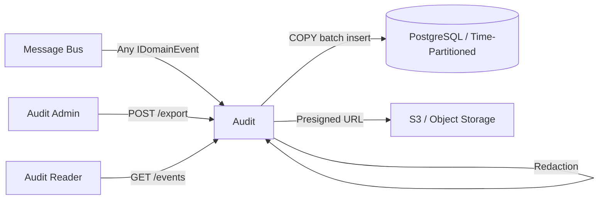
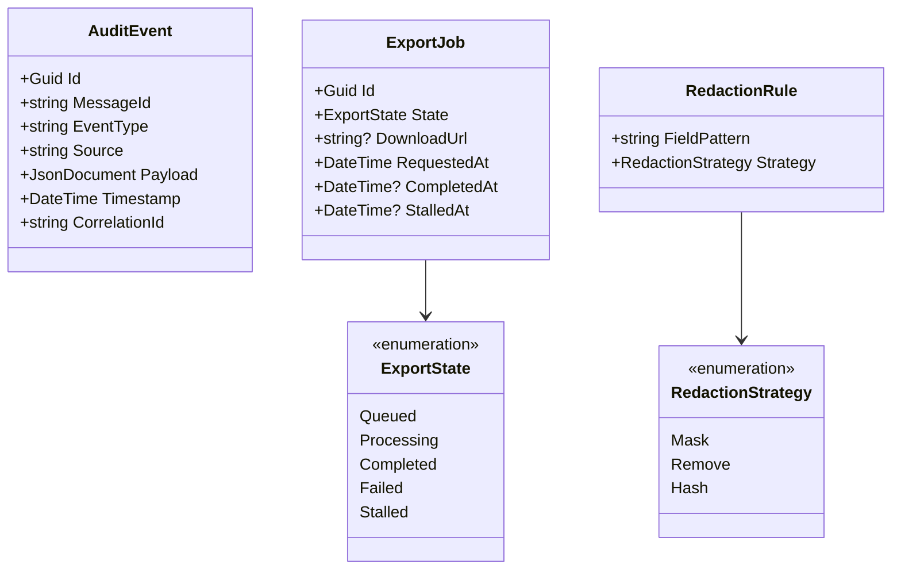

# Audit Service

> Append-only immutable audit log with generic event capture, secret redaction, and async bulk export.

## High-Level Design

## Features

- Append-only immutable audit log (no UPDATE, no DELETE)
- Generic event capture via `AuditConsumer<T>` for any `IDomainEvent`
- Secret redaction before storage (PII, credentials, tokens)
- Deterministic idempotency using SHA-256 message ID
- Async CSV export to S3 with presigned download URLs
- Time-partitioned tables for efficient retention and lifecycle management
- Stalled export job recovery (auto-reset after 10 minutes)

## API Endpoints

| Method | Path | Auth | Description |
|--------|------|------|-------------|
| GET | /audit/events | audit-reader | Query audit events with cursor pagination. Query params: `entityType`, `entityId`, `eventType`, `from`, `to`, `cursor`, `limit` (default 50) |
| GET | /audit/events/{id} | audit-reader | Retrieve a single audit event by ID |
| POST | /audit/export | audit-admin | Initiate async CSV export job |
| GET | /audit/export/{jobId} | audit-reader | Check export job status and retrieve download URL |

## Events

### Published

None. The Audit service is a terminal consumer by design.

### Consumed

| Event | Source | Action |
|-------|--------|--------|
| Any IDomainEvent | All services | Extract metadata, redact secrets, write to audit log |

## Domain Model

## Edge Cases & Hard Problems Solved

- **No updates ever**: Schema enforces immutability; no UPDATE or DELETE grants on the audit table. Application layer has no update method. Retention is managed by dropping entire time partitions.
- **Secret redaction before storage**: A configurable rule engine scans payloads for known secret patterns (tokens, passwords, card numbers) and applies masking/removal/hashing before the write path. No secrets at rest.
- **Deterministic message ID**: If MassTransit `MessageId` is missing or untrusted, a SHA-256 hash of `(event_type + serialized_payload + timestamp)` is computed. Duplicate delivery results in a conflict on the unique index (idempotent).
- **Stalled export job recovery**: A background check runs every 5 minutes; any job in `Processing` state for over 10 minutes is reset to `Queued` for retry, preventing permanent stuck exports.
- **Time-partitioned tables**: Events are partitioned by month. Retention policy drops partitions older than the configured window in a single DDL operation (no row-by-row delete).
- **Role-based access control**: `audit-reader` role grants query access to events; `audit-admin` role is required for export operations. Separation prevents accidental bulk data extraction by read-only consumers.
- **Metadata enrichment**: RabbitMQ routing key and `PublishedBy` service name are automatically extracted from message headers and appended to the audit event metadata before storage. No producer cooperation required.

## Non-Functional Requirements

| Requirement | How Achieved |
|-------------|--------------|
| High-throughput ingestion | PostgreSQL COPY-batched writes; bulk insert of accumulated events |
| Immutability | No UPDATE/DELETE permissions; append-only schema; partition-drop for retention |
| GDPR audit trail compliance | All data access and erasure events captured; tamper-evident via immutability |
| 24h presigned export URLs | S3 presigned URLs with 24-hour TTL; no long-lived credentials exposed |
| Partition rollover for data lifecycle | Monthly partitions; automated creation of future partitions; DROP for expiry |
| Scalable consumption | Generic `AuditConsumer<T>` auto-registered for all event types; concurrent consumers |
