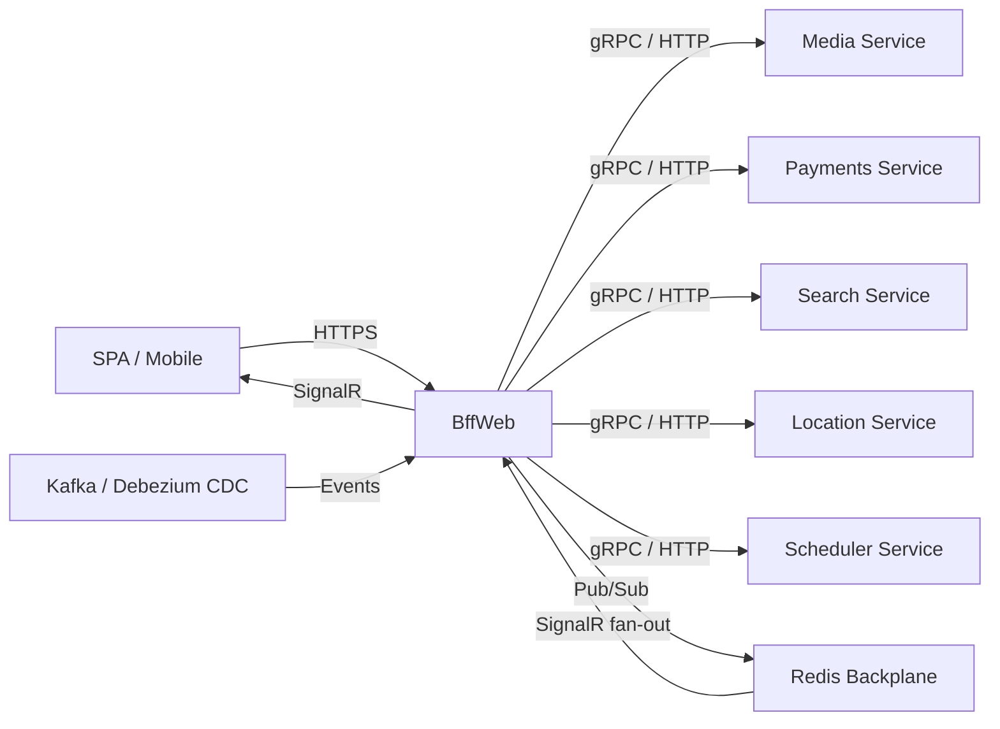

# BffWeb

> Backend-for-Frontend aggregation layer with real-time SignalR bridges, portfolio demo surface, and CDC-driven cache invalidation.

## High-Level Design

## Features

- Backend-for-Frontend aggregation layer — single entry point for all downstream services
- SignalR real-time bridges for checkout, demo, and live console flows
- 3-tier rate limiting: global (all requests), authenticated (per-user), and expensive (costly operations)
- Service-to-service token provider for downstream authentication
- Polly circuit breaker per upstream (70% failure ratio threshold, 15s decay half-life)
- CDC cache invalidation via Kafka Debezium (not polling)
- Portfolio demo surface with 30+ endpoints showcasing saga, idempotency, OCC, circuit-breaker, vault, and cache patterns
- Chaos fault injection for topology and resilience demos
- SSE streaming for health, metrics, and topology data

## API Endpoints

| Method | Path | Auth | Description |
|--------|------|------|-------------|
| POST | /api/checkout | Yes (expensive) | Initiate checkout session |
| POST | /api/checkout/reservations | No | Create stock reservation |
| POST | /api/checkout/reservations/{id}/confirm | Yes | Confirm reservation |
| GET | /api/search | No | Proxy search query |
| POST | /api/search/saved | Yes | Save a search query |
| POST | /api/locations | Yes | Create/geocode location |
| GET | /api/subscriptions/status | Yes | Subscription status proxy |
| POST | /api/subscriptions/create-checkout-session | Yes | Start subscription checkout |
| GET | /api/brand | No | Brand configuration |
| GET | /api/health/snapshot | No | Aggregated health snapshot |
| GET | /api/health/stream | No | SSE health stream |
| GET | /api/metrics/stream | No | SSE metrics stream |
| GET | /api/topology/stream | No | SSE topology stream |
| POST | /api/demo/saga/start | No | Start demo saga journey |
| GET | /api/demo/saga/{sessionId} | No | Poll saga session state |
| POST | /api/demo/events/trigger | No | Trigger demo event |
| POST | /api/demo/circuit/request | No | Circuit breaker demo |
| POST | /api/demo/idempotency/process | No | Idempotency demo |
| POST | /api/demo/cache/stampede | No | Cache stampede demo |
| GET | /api/demo/inventory/{id} | No | OCC demo — read |
| PUT | /api/demo/inventory/{id} | No | OCC demo — update |
| DELETE | /api/demo/inventory/{id} | No | OCC demo — delete |
| GET | /api/system/identity | No | Service instance fingerprint |
| GET | /api/metrics/snapshot | No | Activity counters snapshot |
| POST | /api/demo/chaos/{target}/pause | Admin | Pause chaos target |
| POST | /api/demo/chaos/{target}/resume | Admin | Resume chaos target |

## Events

### Consumed

| Event | Source | Action |
|-------|--------|--------|
| PaymentSessionCreatedEvent | Payments | Bridge to SignalR checkout hub |
| DemoOutboxEvent | Outbox | Bridge to SignalR demo hub |
| StockReservedEvent | Inventory | Saga bridge to SignalR |
| StockReservationFailedEvent | Inventory | Saga bridge to SignalR |
| PaymentSessionCompletedEvent | Payments | Saga bridge to SignalR |
| PaymentAmountMismatchEvent | Payments | Saga bridge to SignalR |
| VaultRotationStageEvent | Scheduler | Bridge to SignalR live console |
| ProductCacheInvalidatedEvent | CDC | Evict distributed cache entry |

## Background Workers

| Worker | Interval | Purpose |
|--------|----------|---------|
| JourneyScheduler | 20s | Drives demo saga cycle automatically |
| UpstreamWarmup | On boot | Parallel health probe burst to warm connections |
| BffCdcCacheInvalidator | Continuous | Kafka CDC consumer that evicts stale cache entries |

## Edge Cases & Hard Problems Solved

- 3-tier rate limiting prevents abuse at global, per-user, and per-expensive-operation granularities without over-blocking legitimate traffic
- Polly circuit breaker uses 70% failure ratio (not 100%) — allows partial failures before tripping, avoiding premature isolation
- Chaos fault injection enables live topology demos without affecting production traffic
- SignalR Redis backplane ensures real-time push works across multiple BFF instances
- CDC cache invalidation via Debezium eliminates polling lag and stale-read windows
- UpstreamWarmup prevents cold-start latency spikes after deployment

## Non-Functional Requirements

| Requirement | How Achieved |
|-------------|--------------|
| Sub-200ms aggregation latency | Parallel downstream calls, connection pooling, warm-up on boot |
| Real-time push | SignalR WebSocket with SSE fallback |
| Horizontal scaling | Stateless instances + Redis backplane for SignalR fan-out |
| Graceful degradation | Per-upstream Polly circuit breakers with fallback responses |
| Cache consistency | Debezium CDC invalidation (sub-second propagation) |
| Abuse prevention | 3-tier rate limiting with sliding window counters |
