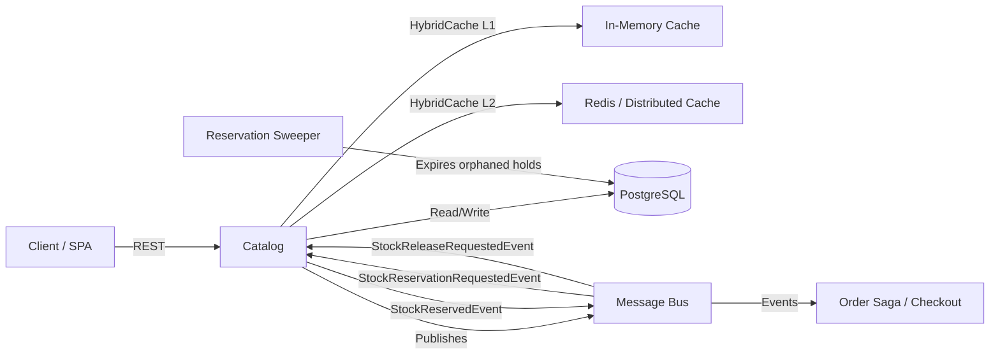
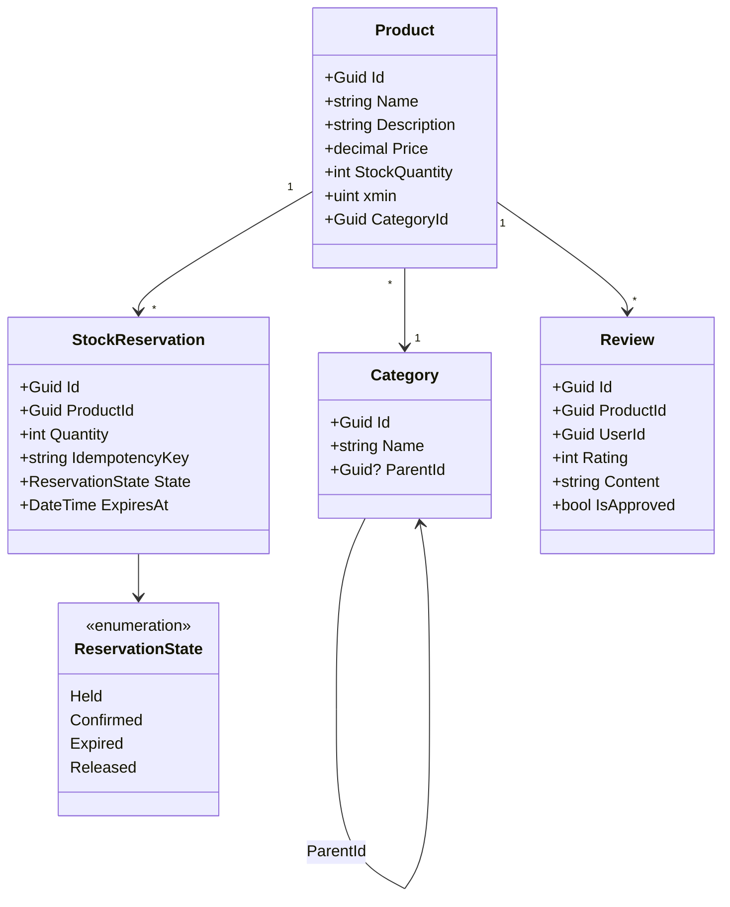

# Catalog Service

> Product catalog, stock reservation, and review management with saga-integrated inventory and hybrid caching.

## High-Level Design

## Features

- Product CRUD with full-text search and pagination
- Category management (hierarchical)
- Product reviews with admin moderation workflow
- Stock reservation integrated with order saga
- Reservation sweeper (expires orphaned holds after 15-min TTL)
- HybridCache with L1 in-memory and L2 distributed layers
- Optimistic concurrency via PostgreSQL xmin (prevents overselling)
- Idempotent reservation creation and confirmation

## API Endpoints

| Method | Path | Auth | Description |
|--------|------|------|-------------|
| GET | /api/products | Anon, paginated | List products with filtering and pagination |
| GET | /api/products/{id} | Anon | Get product details |
| GET | /api/products/{id}/cached | Anon | Get product with cache telemetry headers |
| POST | /api/products | Auth | Create a new product |
| PUT | /api/products/{id} | Auth | Update product details |
| DELETE | /api/products/{id} | Auth | Soft-delete a product |
| POST | /api/products/{id}/reserve | Admin/Service | Reserve stock (internal/saga use) |
| GET | /api/categories | Anon | List all categories |
| POST | /api/categories | Admin | Create a category |
| POST | /api/checkout/reservations | Anon, X-Idempotency-Key | Create a 15-min reservation hold |
| POST | /api/checkout/reservations/{id}/confirm | Auth, X-Idempotency-Key | Confirm reservation (410 Gone if expired) |
| GET | /api/products/{productId}/reviews | Anon, paginated | List reviews for a product |
| POST | /api/products/{productId}/reviews | Auth | Submit a review |
| PUT | /api/products/{productId}/reviews/{id} | Auth | Edit own review |
| DELETE | /api/products/{productId}/reviews/{id} | Auth | Delete own review |
| POST | /api/products/{productId}/reviews/{id}/approve | Admin | Approve a moderated review |

## Events

### Published

| Event | Trigger | Consumers |
|-------|---------|-----------|
| StockReservedEvent | Stock successfully reserved | Order Saga |
| StockReservationFailedEvent | Insufficient stock or concurrency conflict | Order Saga (triggers compensation) |
| StockReleasedEvent | Reservation expired or explicitly released | Order Saga, Analytics |

### Consumed

| Event | Source | Action |
|-------|--------|--------|
| StockReservationRequestedEvent | Order Saga | Attempt atomic stock decrement |
| StockReleaseRequestedEvent | Order Saga (compensation) | Release held stock back to available |

## Domain Model

## Edge Cases & Hard Problems Solved

- **xmin concurrency on stock decrement**: `UPDATE ... SET stock = stock - @qty WHERE id = @id AND xmin = @expected_xmin AND stock >= @qty` prevents overselling under concurrent requests without pessimistic locks.
- **ReservationSweeperService (1-min poll, batch 200, inline stock release)**: Background `ReservationSweeperService` polls every 1 minute, processes batches of 200, transitions Held reservations past 15-min TTL to Expired, releases stock inline per reservation, and publishes StockReleasedEvent for each.
- **Idempotency key scoped to user**: Same key from the same user returns the existing reservation (200) rather than creating a duplicate. Different users may reuse keys safely.
- **410 Gone on expired reservations**: Confirming an expired reservation returns 410 with a clear error, distinguishing from 404 (never existed) for client retry logic.
- **Guest checkout with UserId="guest"**: Anonymous reservation creation assigns `UserId="guest"` allowing checkout without authentication. Confirmation requires an authenticated user with a valid email claim to finalize the order.
- **Email claim required for confirm**: The `/confirm` endpoint extracts the email claim from the JWT; requests without it are rejected with 403, ensuring contact information is available for order fulfillment.
- **Inline stock release during sweep**: Each reservation release is individually committed; partial batch failure does not roll back already-released items (guards against sweeper crash mid-batch).

## Non-Functional Requirements

| Requirement | How Achieved |
|-------------|--------------|
| Sub-ms cache reads | HybridCache L1 in-process; stampede protection prevents thundering herd |
| Atomic stock reservation | Single SQL UPDATE with xmin + quantity guard; no application-level locks |
| Zero-downtime sweeper | Polling-based background service; lease-based single-instance in scaled deployments |
| Outbox-guaranteed delivery | Domain events written transactionally with state change; relay publishes to bus |
| Horizontal scalability | Stateless API; distributed cache L2; sweeper leader election |
