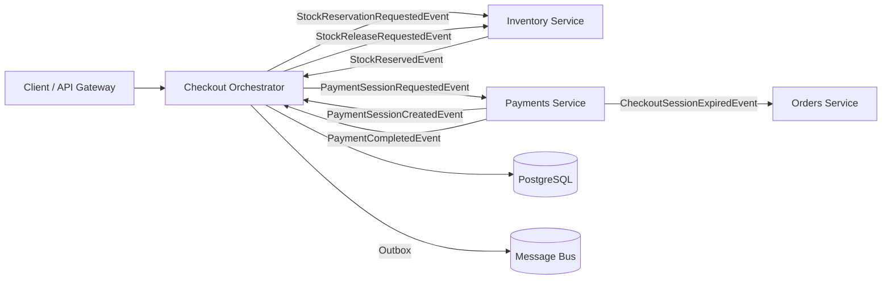
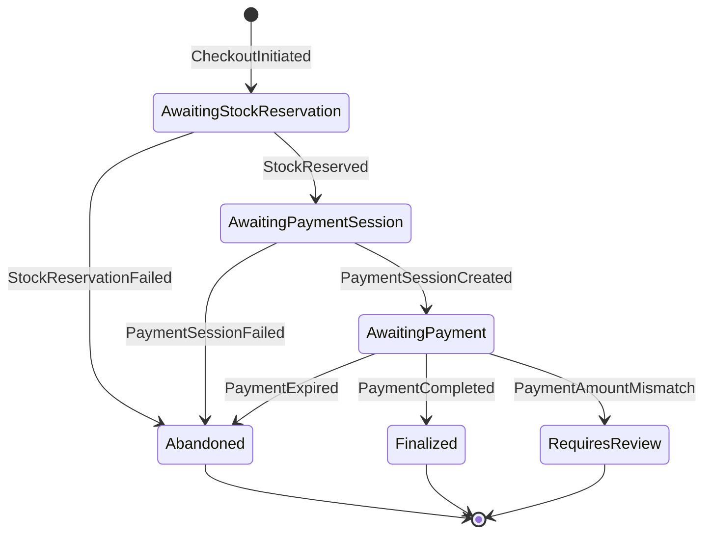
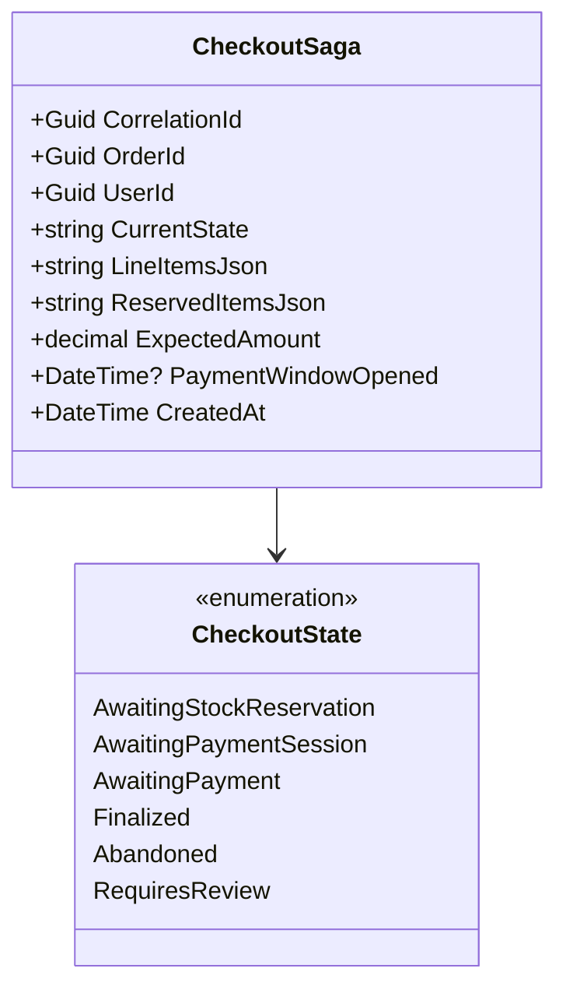

# Checkout Orchestrator

> Saga-based orchestration of the checkout flow: stock reservation, payment session, completion, and compensation on failure.

## High-Level Design

## Features

- Saga-based checkout orchestration with explicit state machine
- 15-minute payment window with automatic expiration
- Stock reservation followed by payment session creation followed by completion
- Full compensation on any failure (stock always released)
- Dual-layer timeout: scheduled message + polling fallback
- Amount mismatch detection routes to ops review (no auto-compensation)

## API Endpoints

| Method | Path | Auth | Description |
|--------|------|------|-------------|
| POST | `/api/checkouts` | Admin / Service | Initiate a new checkout saga |
| GET | `/api/checkouts/{sagaId}` | Authenticated | Get checkout saga state |
| GET | `/api/checkouts/by-order/{orderId}` | Authenticated | Look up checkout by order ID |

## Events

### Published

| Event | Trigger | Consumers |
|-------|---------|-----------|
| StockReservationRequestedEvent | Checkout initiated | Inventory |
| PaymentSessionRequestedEvent | Stock successfully reserved | Payments |
| StockReleaseRequestedEvent | Any failure or expiration | Inventory |
| PaymentExpiredEvent (scheduled) | 15-min timer fires | Self (saga) |

> **Note:** CheckoutSessionExpiredEvent is NOT published by this service. It originates from the Payments webhook processor when Stripe fires `checkout.session.expired`. The PaymentExpiredEvent listed above is a scheduled MassTransit message published by the saga itself as a timeout mechanism, distinct from the Stripe-originated expiry.

### Consumed

| Event | Source | Action |
|-------|--------|--------|
| CheckoutInitiatedEvent | Self / API | Start saga, request stock reservation |
| StockReservedEvent | Inventory | Advance to payment session creation |
| StockReservationFailedEvent | Inventory | Compensate and abandon |
| PaymentSessionCreatedEvent | Payments | Advance to awaiting payment |
| PaymentSessionFailedEvent | Payments | Release stock and abandon |
| PaymentCompletedEvent | Payments | Finalize checkout |
| PaymentAmountMismatchEvent | Payments | Flag for ops review (no auto-compensation) |
| PaymentExpiredEvent | Self (scheduled/polled) | Release stock and expire |

## Saga State Machine

## Domain Model

## Edge Cases & Hard Problems Solved

- **PaymentExpiryWatcher polling fallback** — polls every 60 seconds for expired sagas if the RabbitMQ delayed-message-exchange plugin is unavailable; guarantees expiration even without broker plugin support.
- **Saga carries LineItemsJson/ReservedItemsJson** — compensation data is embedded in the saga instance; no cross-service queries needed during rollback, ensuring compensation works even if other services are down.
- **DuringAny guards** — prevents re-processing events on already-finalized or abandoned sagas; late-arriving messages are safely discarded.
- **RequiresReview for amount mismatches** — no automatic compensation when amounts disagree; ops must investigate and manually resolve, preventing incorrect stock releases on legitimate payments.

## Non-Functional Requirements

| Requirement | How Achieved |
|-------------|--------------|
| Guaranteed stock release on failure | Dual-layer timeout (scheduled message + 60s polling fallback) |
| Exactly-once saga transitions | PostgreSQL `xmin` concurrency token + MassTransit inbox dedup |
| Sub-second event propagation | Outbox query delay set to 1ms |
| Cross-service correlation | All events carry SagaId as CorrelationId |
| Resilience to broker plugin absence | Polling fallback does not depend on delayed-message-exchange |
