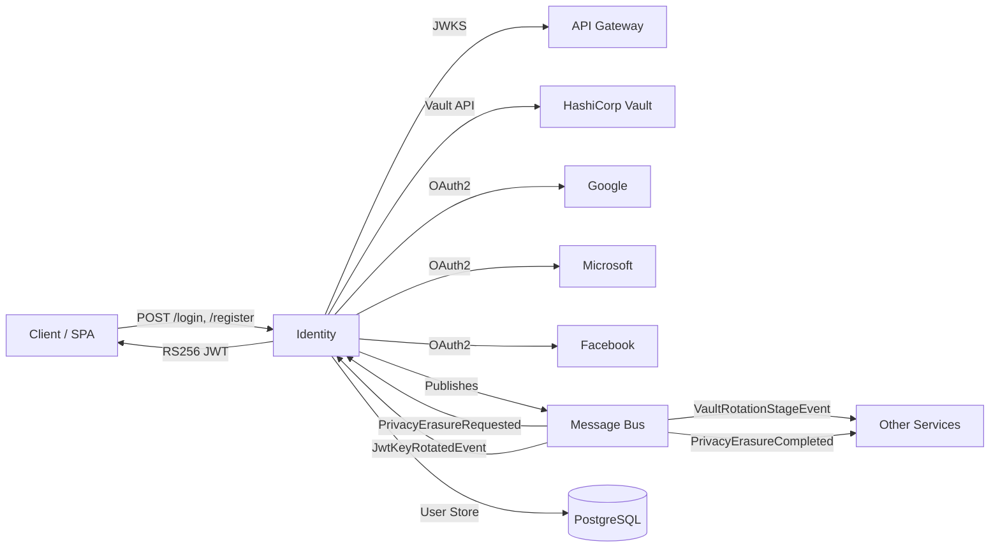
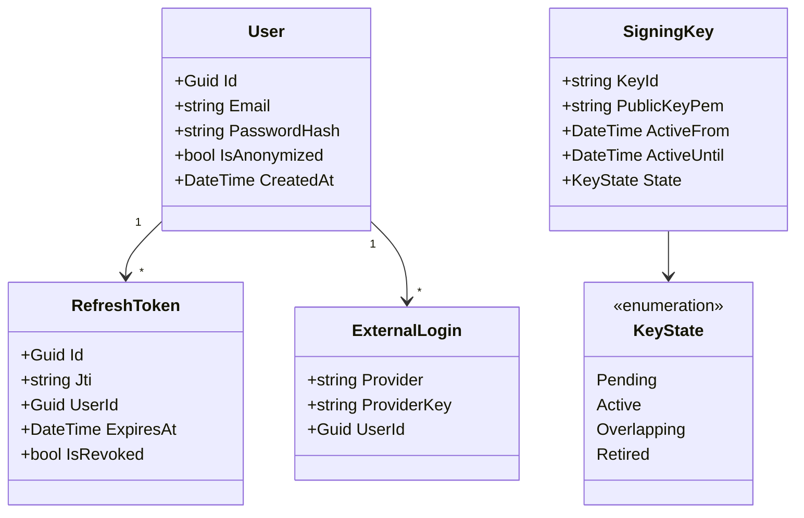

# Identity Service

> Centralized authentication and authorization service with Vault-backed key management, OAuth federation, and GDPR-compliant user lifecycle.

## High-Level Design

## Features

- JWT RS256 token issuance and validation
- Vault-backed signing key rotation with dual-key overlap window
- OAuth external authentication (Google, Microsoft, Facebook) with link/unlink
- JWKS discovery endpoint for federated validation
- Refresh token revocation via JTI blacklist
- Service-to-service token issuance (shared secret)
- GDPR Article 17 erasure (anonymization on request)
- Rate limiting (5 requests/min/IP on auth endpoints)
- CSRF token endpoint for SPA flows

## API Endpoints

| Method | Path | Auth | Description |
|--------|------|------|-------------|
| POST | /api/authentication/register | Anon, rate-limited | Register a new user account |
| POST | /api/authentication/login | Anon, rate-limited | Authenticate and receive JWT + refresh token |
| POST | /api/authentication/logout | Auth | Revoke refresh token, invalidate session |
| GET | /api/authentication/verify-token | Auth | Validate current access token |
| POST | /api/authentication/refresh-token | Rate-limited | Exchange refresh token for new token pair |
| POST | /api/authentication/service-token | Service, X-Service-Secret | Issue a service-to-service JWT |
| GET | /api/authentication/csrf-token | Anon | Obtain CSRF token for state-changing requests |
| GET | /api/external-authentication/challenge/{provider} | Rate-limited | Initiate OAuth challenge redirect |
| GET | /api/external-authentication/callback | Rate-limited | OAuth callback handler |
| GET | /api/external-authentication/providers | Anon | List available external providers |
| POST | /api/external-authentication/link/{provider} | Auth | Link external provider to existing account |
| DELETE | /api/external-authentication/unlink/{provider} | Auth | Unlink external provider from account |
| GET | /api/external-authentication/logins | Auth | List linked external logins |
| GET | /.well-known/jwks.json | Anon | JSON Web Key Set discovery |
| GET | /admin/vault/status | Admin | Vault seal/unseal status and key metadata |
| POST | /admin/vault/rotate-credentials | Admin | Trigger manual credential rotation |

## Events

### Published

| Event | Trigger | Consumers |
|-------|---------|-----------|
| VaultRotationStageEvent | Key rotation lifecycle stage change | All services consuming JWTs |
| PrivacyErasureCompleted | User data anonymized | Compliance, Audit |

### Consumed

| Event | Source | Action |
|-------|--------|--------|
| PrivacyErasureRequested | Compliance / User request | Anonymize user PII, revoke all tokens |
| JwtKeyRotatedEvent | Scheduler | Refreshes Vault credentials + dual-key overlap |

## Domain Model

## Edge Cases & Hard Problems Solved

- **Dual-key overlap window**: During rotation, both old and new keys are valid for 15 minutes. JWKS exposes both; token validation tries current key first, falls back to previous. Prevents in-flight token rejection.
- **JTI revocation checked post-signature in OnTokenValidated**: Signature validation alone is insufficient; revoked JTIs are checked in-memory (bloom filter) with DB fallback in the `OnTokenValidated` event handler, preventing use of structurally valid but logically revoked tokens.
- **Rate limiting on auth endpoints**: 5/min/IP sliding window prevents credential stuffing without impacting legitimate users. Uses a distributed counter when scaled horizontally.
- **External auth link/unlink race conditions**: Optimistic concurrency on the ExternalLogin row prevents two concurrent link requests from creating duplicates or unlinking the last provider when a password is not set.
- **Service-to-service auth via X-Service-Secret header**: Internal services authenticate using a shared secret passed in the `X-Service-Secret` header. The `/api/authentication/service-token` endpoint validates this secret and issues a short-lived JWT scoped to the calling service.
- **Vault unavailability**: Graceful degradation to static keys with health check alerts. Service remains operational with last-known-good key material cached in memory.

## Non-Functional Requirements

| Requirement | How Achieved |
|-------------|--------------|
| Sub-100ms token validation | In-memory key ring; no network call on validate path |
| Zero-downtime key rotation | Dual-key overlap window; rolling deployment compatibility |
| GDPR Article 17 erasure | Full PII anonymization; event-driven cross-service coordination |
| OWASP rate limiting | Sliding window per IP; distributed counter for horizontal scale |
| High availability | Stateless service (key ring cached); Vault failure does not block requests |
| Auditability | All auth events published to bus; consumed by Audit service |
