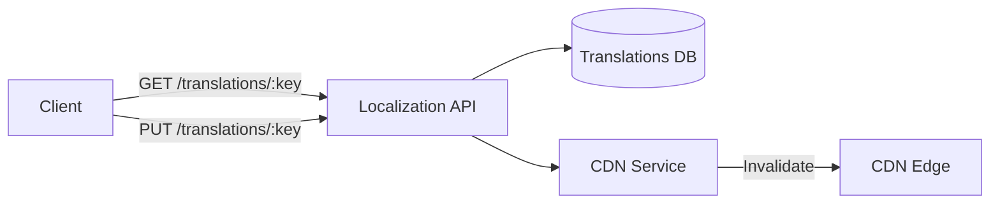
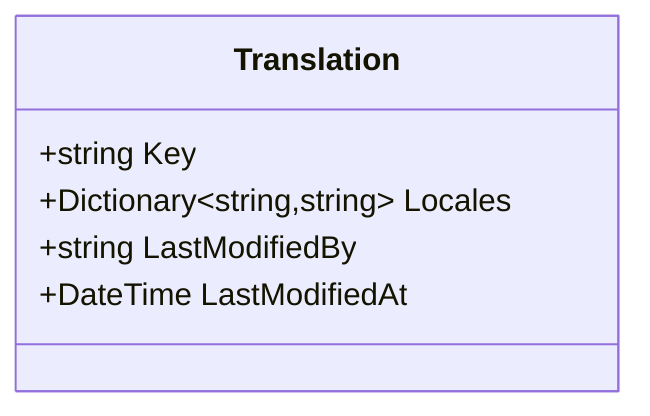

# Localization Service

> Translation key-value store with locale-keyed dictionaries, CDN integration, and user attribution tracking.

## High-Level Design

## Features

- Translation key-value store keyed by locale
- Single record per key stores all locales (no N+1 queries)
- CDN service abstraction for edge cache invalidation on updates
- User attribution tracking (who last modified each translation)

## API Endpoints

| Method | Path | Auth | Description |
|--------|------|------|-------------|
| GET | /api/translations/{key}?locale= | Yes | Retrieve translation for a key and locale |
| PUT | /api/translations/{key} | Yes | Create or update a translation |

## Events (Published)

| Event | Trigger |
|-------|---------|
| TranslationMissingEvent | Key not found for locale — enables monitoring of missing translations |

## Domain Model

## Edge Cases & Hard Problems Solved

- One Translation record stores all locales in a dictionary column, eliminating N+1 queries when fetching multiple locales
- CDN invalidation triggered on every PUT ensures edge caches never serve stale translations
- User attribution on every write provides full audit lineage
- Concurrent upsert handling (retry-on-constraint-violation for simultaneous creates)

## Non-Functional Requirements

| Requirement | How Achieved |
|-------------|--------------|
| Sub-ms lookups | DB indexed by key |
| CDN propagation | Automatic invalidation on update |
| No N+1 queries | All locales in single record |
| Audit lineage | LastModifiedBy on every write |
