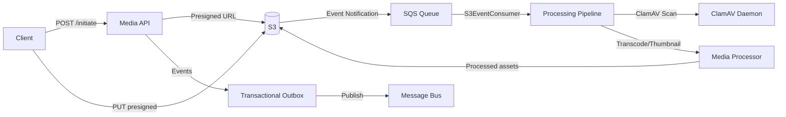
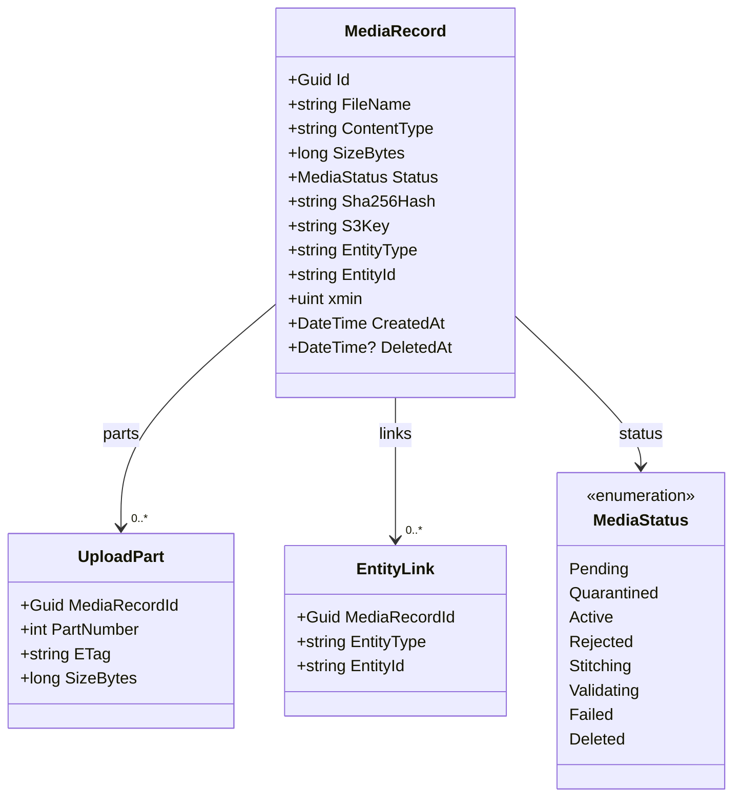

# Media Service

> Zero-bandwidth media management with presigned S3 uploads, virus scanning, and asynchronous processing pipelines.

## High-Level Design

## Features

- Direct S3 upload/download via presigned URLs (zero bandwidth through API)
- Multipart upload supporting up to 256 GB in 10,000 parts
- Magic-byte file signature validation (blocks executables via MZ header detection)
- ClamAV virus scanning in dual mode: INSTREAM for small files, filesystem for large
- S3 event notifications via SQS (handles both S3-to-SQS and S3-to-SNS-to-SQS formats)
- Media processing pipeline (transcode, thumbnails, audio extraction)
- Entity linkage (associate media with any domain entity)
- Batch upload initiation (up to 50 files per request)
- Soft-delete with metadata preservation
- Upload sweeper (expires stale Pending uploads after 6 hours)

## API Endpoints

| Method | Path | Auth | Description |
|--------|------|------|-------------|
| POST | /api/media/initiate | Yes | Initiate single or multipart upload; returns presigned URL(s) |
| POST | /api/media/batch-initiate | Yes | Batch initiate up to 50 file uploads |
| POST | /api/media/{id}/complete | Yes | Mark upload complete; triggers scan pipeline |
| POST | /api/media/{id}/complete-multipart | Yes | Stitch multipart parts and trigger scan |
| POST | /api/media/{id}/abort | Yes | Abort an in-progress upload |
| GET | /api/media/{id} | Yes | Retrieve media metadata |
| GET | /api/media | Yes | List media with pagination |
| GET | /api/media/{id}/url | Yes | Generate presigned download URL |
| POST | /api/media/{id}/link | Yes | Link media to a domain entity |
| DELETE | /api/media/{id} | Yes | Soft-delete media record |

## Events

### Published

| Event | Trigger | Consumers |
|-------|---------|-----------|
| MediaUploadInitiatedEvent | Upload initiation request | Audit log, monitoring |
| MediaAvailableEvent | Media passes scan and processing completes | Catalog, frontend cache, linked entity services |
| MediaQuarantinedEvent | ClamAV detects malware or scan flags content | Notification service, security alerting |
| MediaScanPassedEvent | ClamAV scan returns clean | Processing pipeline, linked entity services |
| MediaScanFailedEvent | ClamAV detects malware | Quarantine handler, notification service |
| MediaProcessingCompletedEvent | Transcode/thumbnail generation finishes | Catalog, frontend cache |
| MediaProcessingFailedEvent | Processing pipeline error | Alerting, retry infrastructure |
| MediaDeletedEvent | Soft-delete executed | Search index, linked entity cleanup |

### Consumed

| Event | Source | Action |
|-------|--------|--------|
| ProcessMediaCommand | Internal pipeline | Execute transcode/thumbnail/audio processing |
| MediaUploadCompletedEvent | S3 notification path (SQS) | Trigger scan and processing pipeline |

## Domain Model

## Edge Cases & Hard Problems Solved

- **Hash verification**: Client declares SHA-256 at initiation; server recomputes after upload and rejects mismatches, preventing content substitution attacks.
- **S3EventConsumer dual-format parsing**: Handles both direct S3-to-SQS notifications and S3-to-SNS-to-SQS wrapped messages transparently.
- **UploadSweeperWorker**: Background worker expires uploads stuck in Pending status for more than 6 hours, preventing orphaned S3 objects from accumulating.
- **ClamAV dual-mode scanning**: Files under 25 MB use INSTREAM (streamed to daemon); larger files use filesystem mode to avoid OOM in the ClamAV process.
- **FileSignatureValidator**: Validates magic bytes regardless of declared content-type; blocks MZ headers (PE executables) and other dangerous signatures.
- **QuarantineAsync**: Infected files are moved to a `quarantine/` S3 prefix rather than deleted, preserving evidence for forensic review.
- **Concurrent scan detection**: `MediaUploadCompletedConsumer` catches `DbUpdateConcurrencyException` gracefully, preventing duplicate scan pipeline triggers when the same S3 event is delivered more than once.
- **Hash verification on S3 event path**: Server recomputes SHA-256 on the S3 event notification path and rejects mismatches, preventing content substitution attacks even when uploads bypass the `/complete` endpoint.
- **Optimistic concurrency**: Uses PostgreSQL `xmin` system column for conflict-free concurrent metadata updates without explicit version columns.

## Non-Functional Requirements

| Requirement | How Achieved |
|-------------|--------------|
| Zero API bandwidth for media transfer | All uploads/downloads use presigned S3 URLs; API only handles metadata |
| 256 GB maximum file support | Multipart upload with up to 10,000 parts |
| Sub-second upload initiation | Presigned URL generation is a lightweight S3 API call |
| Fail-closed virus scanning | Scan failure (ClamAV unavailable) results in rejection, never silent pass-through |
| Optimistic concurrency | PostgreSQL xmin-based conflict detection |
| Guaranteed event delivery | Transactional outbox pattern ensures events publish even if broker is temporarily down |
| Stale upload cleanup | UploadSweeperWorker runs on schedule; no manual intervention needed |
