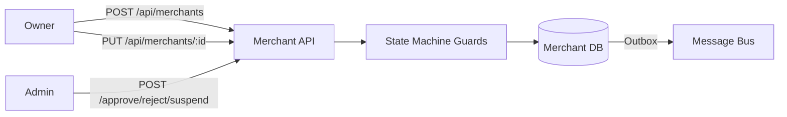
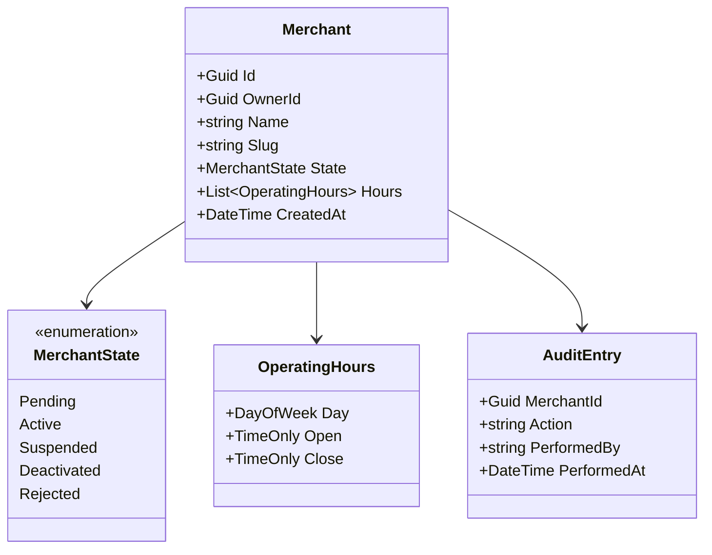

# Merchant Service

> Merchant onboarding and lifecycle management with admin approval workflows, state machine governance, and full audit trail.

## High-Level Design

## Features

- Merchant onboarding with mandatory admin approval
- State machine lifecycle (Pending, Active, Suspended, Deactivated, Rejected)
- Operating hours management
- Slug-based public lookup
- Separation of owner self-service vs admin operations
- Full audit trail (who performed each transition and when)

## API Endpoints

| Method | Path | Auth | Description |
|--------|------|------|-------------|
| POST | /api/merchants | Yes | Register a new merchant |
| GET | /api/merchants/{id} | Yes | Get merchant by ID |
| GET | /api/merchants/by-slug/{slug} | Yes | Get merchant by slug |
| GET | /api/merchants/mine | Yes | Get current user's merchant |
| GET | /api/merchants | Admin | List merchants (filtered) |
| PUT | /api/merchants/{id} | Owner | Update merchant details |
| PUT | /api/merchants/{id}/hours | Owner | Update operating hours |
| POST | /api/merchants/{id}/approve | Admin | Approve pending merchant |
| POST | /api/merchants/{id}/reject | Admin | Reject pending merchant |
| POST | /api/merchants/{id}/suspend | Admin | Suspend active merchant |
| POST | /api/merchants/{id}/deactivate | Owner/Admin | Deactivate merchant |

## Events (Published)

| Event | Trigger |
|-------|---------|
| MerchantCreatedEvent | New merchant registered |
| MerchantActivatedEvent | Admin approves merchant |
| MerchantSuspendedEvent | Admin suspends merchant |
| MerchantDeactivatedEvent | Merchant deactivated |

## Domain Model

## Edge Cases & Hard Problems Solved

- State machine guards validate legal transitions (e.g., cannot approve an already-active merchant)
- Slug uniqueness enforced at DB level with friendly error propagation
- Owner vs admin operation separation prevents privilege escalation
- All transitions produce audit entries with actor identity and timestamp
- UpdateMerchant and SetOperatingHours publish no events (intentional — purely local mutations)

## Non-Functional Requirements

| Requirement | How Achieved |
|-------------|--------------|
| Audit trail | Every state transition persisted with actor + timestamp |
| Reliable event delivery | Transactional outbox pattern |
| Data integrity | State machine guards prevent illegal transitions |
| Slug uniqueness | Unique DB constraint + application-level validation |
