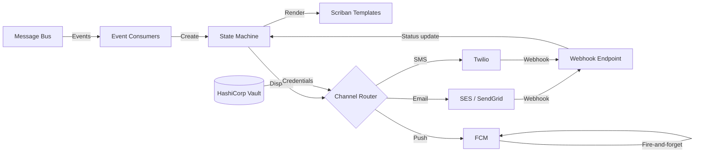
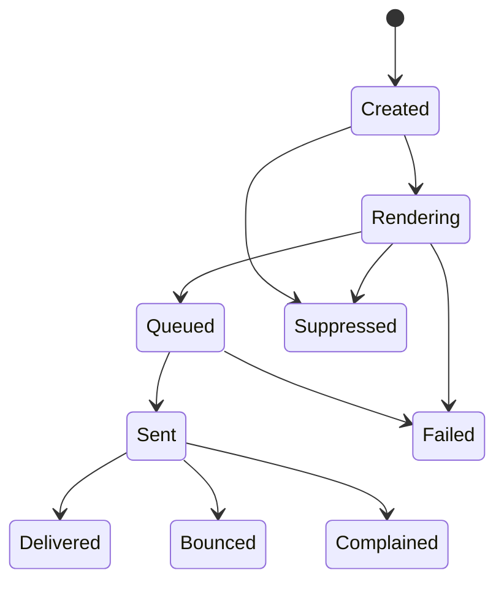
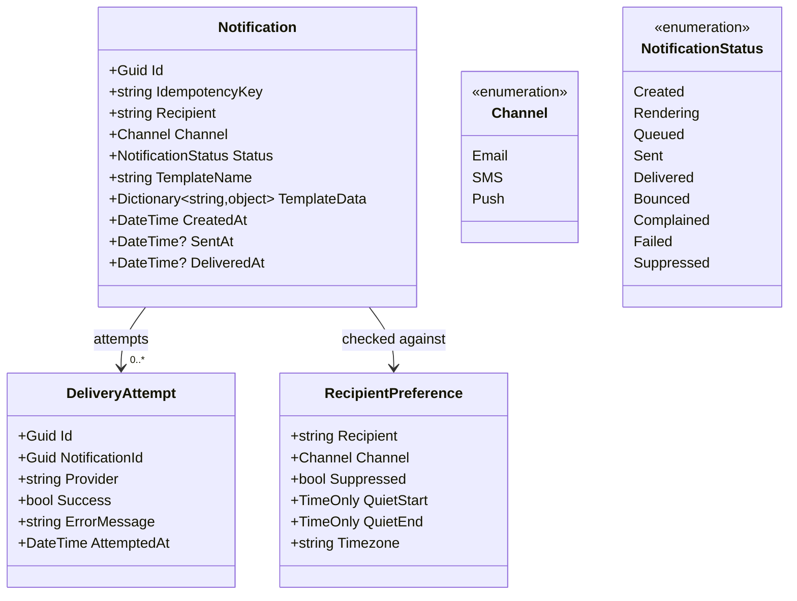

# Notifications Service

> Multi-channel, multi-provider notification dispatch with circuit-breaker failover, template rendering, and full delivery lifecycle tracking.

## High-Level Design

## Features

- Multi-channel delivery: Email, SMS, and Push notifications
- Multi-provider per channel with automatic failover (SES + SendGrid, Twilio, FCM)
- Polly circuit breakers per provider (5 failures triggers 30-second break)
- Template rendering via Scriban with hot-reload support
- Full delivery attempt tracking with state machine lifecycle
- Webhook callbacks for delivery-status providers (SES, SendGrid, Twilio)
- Preference suppression and quiet hours enforcement
- Rate limiting (100 notifications per minute per recipient)
- Vault-based credential rotation with degraded-start fallback
- SHA-256 IdempotencyKey deduplication

## API Endpoints

| Method | Path | Auth | Description |
|--------|------|------|-------------|
| POST | /api/notifications | Yes | Send a notification (email/SMS/push) |
| GET | /api/notifications/{id} | Yes | Retrieve notification status and delivery history |
| POST | /api/notifications/webhooks/ses | No | SES delivery/bounce/complaint callbacks |
| POST | /api/notifications/webhooks/sendgrid | No | SendGrid event callbacks |
| POST | /api/notifications/webhooks/twilio | No | Twilio delivery status callbacks |

## Events

### Published

| Event | Trigger | Consumers |
|-------|---------|-----------|
| NotificationDeliveredEvent | Provider confirms delivery via webhook | Audit log, analytics |
| NotificationFailedEvent | All providers exhausted or terminal failure | Alerting, dead-letter review |
| NotificationBouncedEvent | Provider reports hard/soft bounce via webhook | Recipient suppression list, analytics |
| NotificationWebhookValidatedEvent | Webhook signature verified and payload parsed | State machine (delivery status update) |

### Consumed

| Event | Source | Action |
|-------|--------|--------|
| NotificationCreatedEvent | Internal (after API call persisted) | Begin dispatch pipeline |
| RefundCompletedEvent | Payments service | Send refund confirmation email |
| RefundFailedEvent | Payments service | Send refund failure notification |
| RefundStalledEvent | Payments service | Send refund stalled alert to support |
| NotificationWebhookValidatedEvent | Webhook endpoint | Update delivery state (Delivered/Bounced/Complained) |
| SecretExpiryWarningEvent | Vault integration | Trigger credential rotation |

## State Machine

## Domain Model

## Edge Cases & Hard Problems Solved

- **Circuit breaker per provider**: Polly monitors each provider independently; after 5 consecutive failures, the circuit opens for 30 seconds and dispatch falls through to the next provider in priority order.
- **SHA-256 IdempotencyKey deduplication**: Prevents duplicate sends when the same event is consumed more than once (at-least-once semantics).
- **Terminal-state guard**: Once a notification reaches Sent, Delivered, or Failed, the state machine rejects any re-dispatch commands, preventing duplicate sends on replayed events.
- **Vault credential rotation with degraded-start fallback**: If Vault is unreachable at startup, the service starts with last-known credentials and retries rotation on a schedule.
- **Created/Rendering to Suppressed transition**: Notifications can transition from Created or Rendering directly to Suppressed when preference or rate-limit suppression is detected before queuing, avoiding unnecessary rendering work.
- **Preference suppression**: Recipient preferences are checked before dispatch; suppressed channels skip silently and record a Suppressed state.
- **Quiet hours enforcement**: Notifications are held until the recipient's quiet window ends (timezone-aware), then released for dispatch.
- **Provider webhook signature verification**: Each webhook endpoint validates provider-specific signatures before processing, preventing spoofed status updates.

## Non-Functional Requirements

| Requirement | How Achieved |
|-------------|--------------|
| Multi-provider failover in sub-second | Polly circuit breakers with immediate fallthrough to next provider |
| At-least-once delivery | Transactional outbox + inbox pattern with state machine terminal guards |
| Provider circuit isolation | Failure in one provider (e.g., SES) does not affect others (e.g., SendGrid) |
| Template hot-reload | Scriban templates loaded from filesystem with change-watcher; no redeploy needed |
| GDPR preference compliance | Suppression checks enforced before any dispatch; quiet hours respected |
| Rate limiting | 100 notifications/min per recipient; excess queued with backpressure |
| Credential security | Vault-managed secrets with automatic rotation; no secrets in config files |
