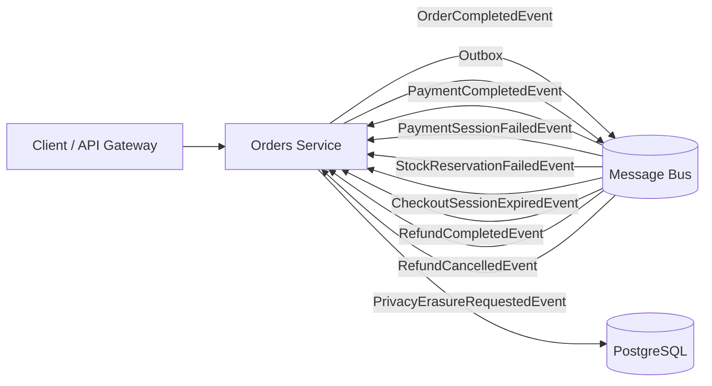
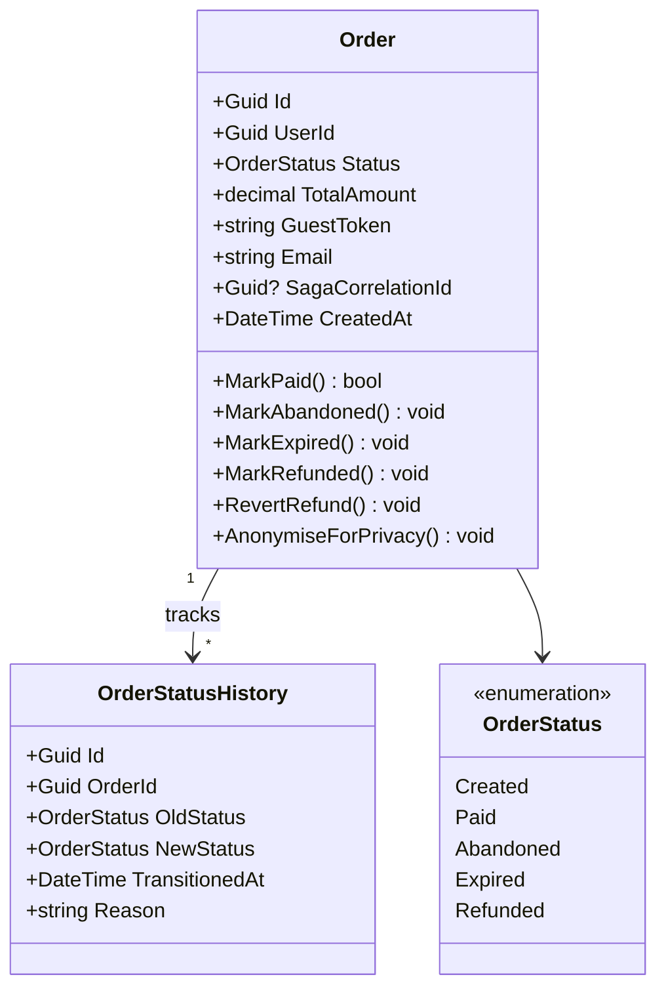

# Orders Service

> Manages the complete order lifecycle from creation through payment, expiration, refund, and GDPR erasure.

## High-Level Design

## Features

- Order lifecycle state machine (Created, Paid, Abandoned, Expired, Refunded)
- Guest order lookup via token + email (no account required)
- Order status history with full audit trail of every transition
- GDPR anonymization (PrivacyErasureRequestedEvent triggers PII scrub)
- Saga correlation for distributed checkout flow
- Stock release failure tracking

## API Endpoints

| Method | Path | Auth | Description |
|--------|------|------|-------------|
| GET | `/api/orders/{id}` | Authenticated | Retrieve a single order by ID |
| GET | `/api/orders/by-user/{userId}` | Authenticated | List orders for a user (Admin sees all) |
| GET | `/api/orders/lookup?token=&email=` | Anonymous | Guest order lookup by token and email |
| POST | `/api/orders` | Authenticated | Create a new order |

## Events

### Published

| Event | Trigger | Consumers |
|-------|---------|-----------|
| OrderCompletedEvent | Order transitions to Paid | CheckoutOrchestrator, Payouts |
| OrderAbandonedEvent | Payment/stock failure | Notifications, Analytics |
| PrivacyErasureCompleted | GDPR erasure done | Privacy saga |

### Consumed

| Event | Source | Action |
|-------|--------|--------|
| PaymentCompletedEvent | Payments | Transition order to Paid |
| PaymentSessionFailedEvent | Payments | Transition order to Abandoned |
| StockReservationFailedEvent | Inventory | Transition order to Abandoned |
| CheckoutSessionExpiredEvent | Payments (Stripe webhook) | Transition order to Expired |
| RefundCompletedEvent | Payments | Transition order to Refunded |
| RefundCancelledEvent | Payments | Revert order from Refunded to Paid |
| PrivacyErasureRequestedEvent | Identity/GDPR | Anonymize all PII on the order |

## Domain Model

## Edge Cases & Hard Problems Solved

- **Idempotent MarkPaid()** — returns `bool`; duplicate PaymentCompletedEvent messages are safely ignored without throwing.
- **RefundCancelled reverts Refunded to Paid** — rare but real scenario when a refund is reversed after completion; explicit state revert with audit trail entry.
- **EF retry-on-failure** — 5 retries configured for Docker/Npgsql EOF errors (transient connection resets during container orchestration).
- **OrderStatusHistory captures every transition** — full audit trail for compliance and debugging, including the reason string.
- **AnonymiseForPrivacy is idempotent** — repeated erasure requests produce the same result without error; safe for at-least-once delivery.
- **CheckoutSessionExpiredConsumer publishes StockReleaseRequestedEvent** — defensive compensation ensuring stock is released even if the orchestrator's own release message was lost.

## Non-Functional Requirements

| Requirement | How Achieved |
|-------------|--------------|
| Guaranteed event delivery | Transactional outbox pattern — events written in same DB transaction as state change |
| Optimistic concurrency | PostgreSQL `xmin` column used as concurrency token |
| Exactly-once message processing | MassTransit inbox deduplication prevents reprocessing |
| Transient fault tolerance | EF Core retry policy (5 retries) for Npgsql connection failures |
| Auditability | Every status transition recorded in OrderStatusHistory |
