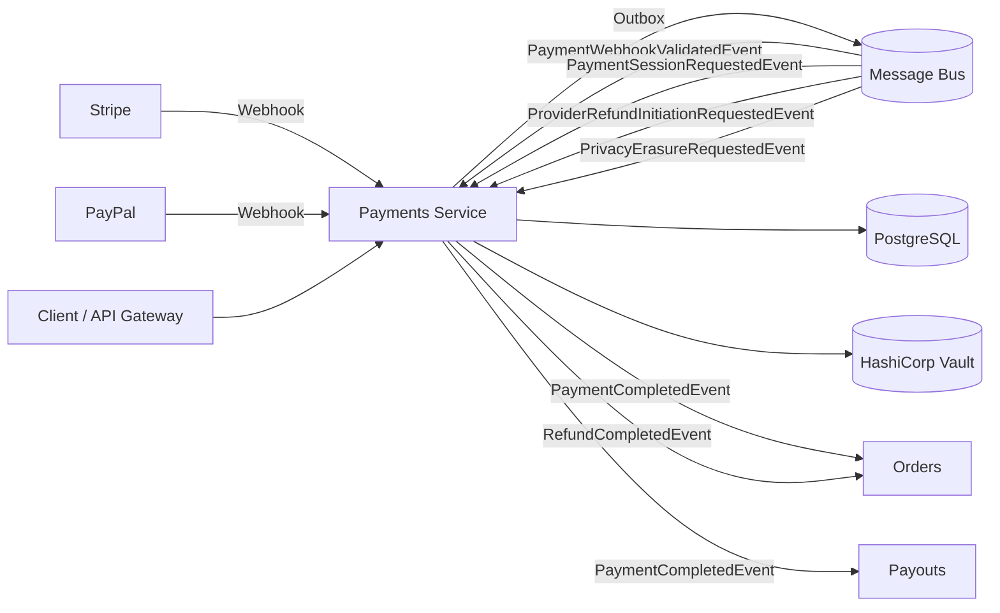
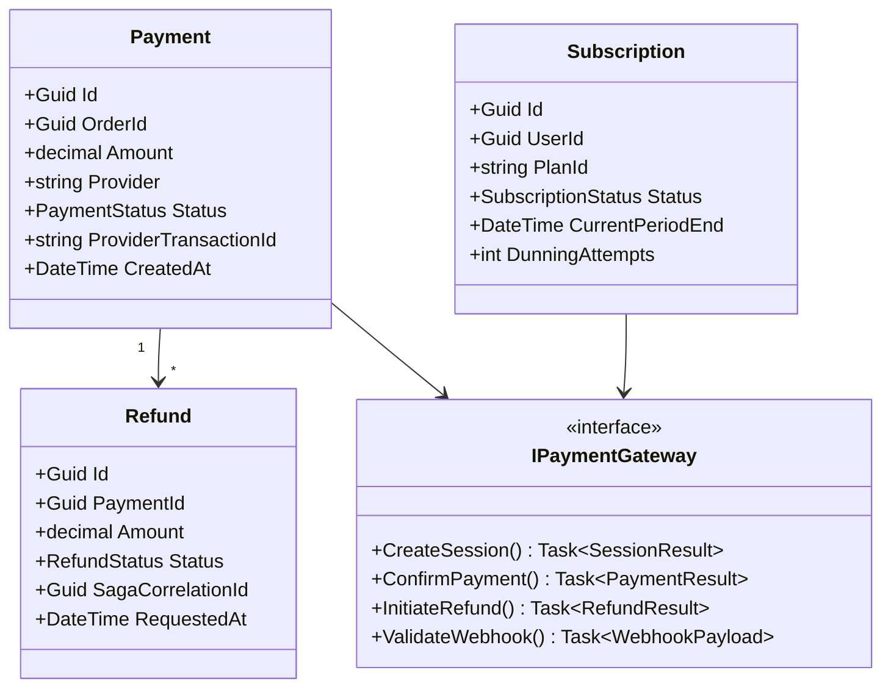

# Payments Service

> Multi-provider payment processing with webhook ingestion, refund orchestration, and subscription lifecycle management.

## High-Level Design



## Features

- Multi-provider support (Stripe + PayPal) via `IPaymentGateway` abstraction
- Webhook ingress with cryptographic signature validation per provider
- Refund saga with 24-hour timeout and RequiresReview terminal state
- Subscription saga with dunning retries and 7-day grace period
- Three-phase payment orchestration (session creation, confirmation, completion)
- Provider abstraction allows new gateways without touching orchestration
- Relay pause/resume for controlled demo environments

## API Endpoints

| Method | Path | Auth | Description |
|--------|------|------|-------------|
| POST | `/api/refunds` | Admin | Initiate a refund |
| GET | `/api/refunds/{id}` | Admin | Get refund status |
| GET | `/api/subscriptions/status` | Authenticated | Get current subscription status |
| POST | `/api/subscriptions/create-checkout-session` | Authenticated | Create a subscription checkout session |
| POST | `/api/subscriptions/cancel` | Authenticated | Cancel active subscription |
| POST | `/api/subscriptions/resume` | Authenticated | Resume cancelled subscription |
| POST | `/webhooks/stripe` | Anonymous (signature-validated) | Stripe webhook ingress |
| POST | `/webhooks/paypal` | Anonymous (signature-validated) | PayPal webhook ingress |
| POST | `/admin/demo-event` | Admin | Publish a synthetic event for demos |
| POST | `/admin/relay-pause` | Admin | Pause outbox relay |
| POST | `/admin/relay-resume` | Admin | Resume outbox relay |
| GET | `/admin/relay-status` | Admin | Check outbox relay status |

## Events

### Published

| Event | Trigger | Consumers |
|-------|---------|-----------|
| PaymentCompletedEvent | Provider confirms successful charge | Orders, Payouts, CheckoutOrchestrator |
| PaymentSessionFailedEvent | Payment session creation or charge fails | Orders, CheckoutOrchestrator |
| PaymentAmountMismatchEvent | Webhook amount differs from expected | CheckoutOrchestrator (ops review) |
| RefundCompletedEvent | Provider confirms refund processed | Orders |
| RefundFailedEvent | Provider rejects refund or timeout | Ops alerting |
| CheckoutSessionExpiredEvent | Stripe fires checkout.session.expired webhook | Orders |
| SubscriptionRenewalRequestedEvent | Subscription period ends | Internal processing |
| SubscriptionGracePeriodStartedEvent | Payment fails, grace period begins | Notification service |

### Consumed

| Event | Source | Action |
|-------|--------|--------|
| PaymentWebhookValidatedEvent | Self (webhook endpoint) | Process validated webhook payload |
| PaymentSessionRequestedEvent | CheckoutOrchestrator | Create payment session with provider |
| ProviderRefundInitiationRequestedEvent | RefundSaga | Execute refund against provider API |
| PrivacyErasureRequestedEvent | Identity/GDPR | Scrub PII from payment records |
| SubscriptionRenewalRequestedEvent | Internal timer/saga | Attempt subscription renewal charge |

## Sagas

### RefundSaga

```
Requested -> AwaitingProviderConfirmation -> Refunded | RequiresReview
```

- 24-hour timeout from AwaitingProviderConfirmation to RequiresReview (terminal)
- Ops must manually resolve RequiresReview states

### SubscriptionSaga

```
Active -> GracePeriod -> Cancelled
```

- Dunning: N retries over 7-day grace period before cancellation
- Each retry publishes SubscriptionRenewalRequestedEvent

## Domain Model



## Edge Cases & Hard Problems Solved

- **Deterministic MessageId from webhook** — `sha256(provider:eventId)[..16]` generates a stable GUID for MassTransit inbox deduplication; replayed webhooks are safely ignored.
- **Amount mismatch detection** — compares `Payment.Amount` against the webhook-reported amount; mismatches are flagged via `PaymentAmountMismatchEvent` for ops review rather than silent acceptance.
- **Refund 24h timeout** — if provider never confirms, saga transitions to `RequiresReview` terminal state; prevents indefinite in-flight refunds.
- **Subscription dunning** — N retries spaced over 7-day grace period before hard cancellation; mimics industry-standard dunning behavior.
- **Vault credential loading with degraded-start fallback** — service boots in degraded mode if Vault is unreachable, retrying credential fetch in background; avoids hard dependency on Vault availability at startup.

## Non-Functional Requirements

| Requirement | How Achieved |
|-------------|--------------|
| Zero lost payments | Transactional outbox + MassTransit inbox + deterministic dedup |
| Sub-second webhook acknowledgment | HTTP 200 returned immediately; async processing via internal event |
| Provider health visibility | Health checks per provider endpoint |
| Fault isolation | Circuit breaker per provider (prevents cascade) |
| Credential security | HashiCorp Vault integration with runtime rotation |
