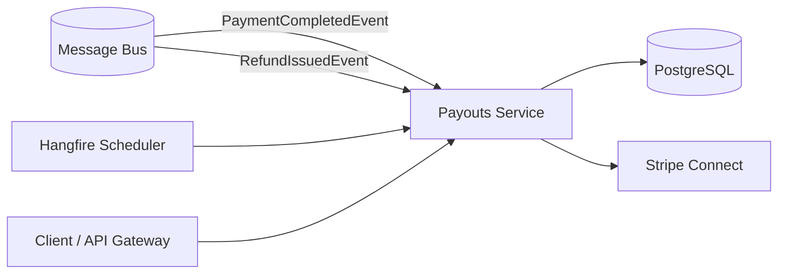
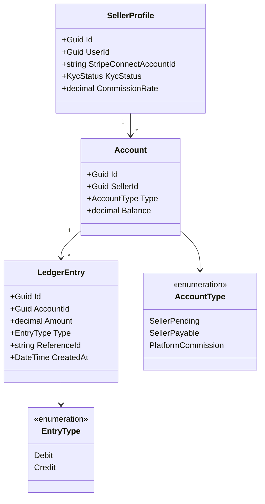

# Payouts Service

> Double-entry bookkeeping and fund maturation pipeline for marketplace seller payouts via Stripe Connect.

## High-Level Design

## Features

- Double-entry bookkeeping (every transaction = debit + credit pair)
- Fund maturation pipeline: Pending, Payable, Disbursed
- Stripe Connect payouts for marketplace sellers
- Seller profiles with KYC verification status
- Configurable commission calculation
- Refund reversal (debit seller on refund)
- Hangfire job coordination for daily payouts and hourly maturation

## API Endpoints

| Method | Path | Auth | Description |
|--------|------|------|-------------|
| GET | `/api/payouts/seller/{sellerId}` | Authenticated (seller-scoped) | Get payout history and balance for a seller |
| POST | `/api/sellers` | Authenticated | Register seller profile |
| POST | `/api/sellers/{sellerId}/onboarding-link` | Authenticated | Get Stripe Connect onboarding link |
| GET | `/api/ledger/balance/{ownerId}` | Authenticated | Get account balance |

## Events

### Published

None (terminal service in the event flow).

### Consumed

| Event | Source | Action |
|-------|--------|--------|
| PaymentCompletedEvent | Payments | Credit seller's SellerPending account (minus commission) |
| RefundIssuedEvent | Payments | Debit seller's account to reverse the credit |

## Background Jobs

| Job | Schedule | Description |
|-----|----------|-------------|
| process-payouts | Daily | Disburse eligible SellerPayable funds via Stripe Connect |
| mature-funds | Hourly | Move matured funds from SellerPending to SellerPayable |

## Domain Model

## Edge Cases & Hard Problems Solved

- **Double-entry prevents balance drift** — every transaction is a debit + credit pair; if one side fails, the transaction is rolled back entirely. No single-sided mutations.
- **Unique constraint (ReferenceId, AccountId) prevents double-crediting** — if the same PaymentCompletedEvent is delivered twice, the second insert hits a unique violation and is safely caught (PostgreSQL error code 23505).
- **SKIP LOCKED in maturation query** — prevents row contention when multiple instances or retries attempt to mature the same pending entries simultaneously.
- **Hangfire DisableConcurrentExecution (300s)** — prevents parallel job runs even in multi-instance deployments; mutual exclusion at the scheduler level.
- **"REFUND:" prefix on ReferenceId** — creates a distinct ledger entry for the same payment, allowing both the original credit and refund debit to coexist under the unique constraint.

## Non-Functional Requirements

| Requirement | How Achieved |
|-------------|--------------|
| Financial accuracy | Double-entry ledger with `numeric(18,2)` — no floating point |
| Idempotent credit/debit | Unique constraint on (ReferenceId, AccountId) + catch PostgreSQL 23505 |
| Distributed job coordination | Hangfire with DisableConcurrentExecution + SKIP LOCKED queries |
| Daily reconciliation capability | Ledger entries are immutable and fully auditable |
| Payout reliability | Stripe Connect with idempotency keys per disbursement |
