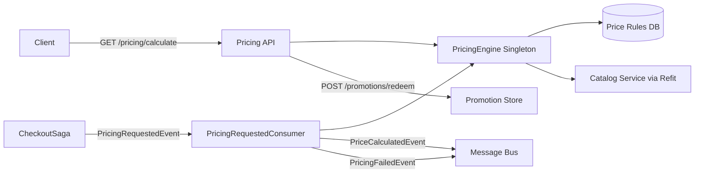
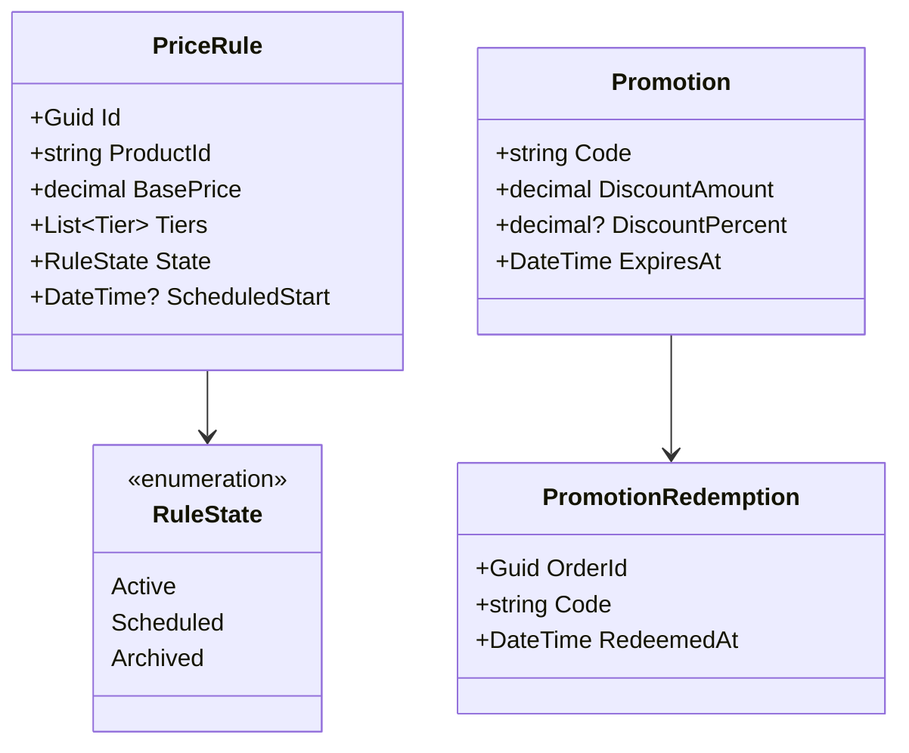

# Pricing Service

> Stateless dynamic pricing engine with tiered rules, promotion redemption, and configurable tax calculation strategies.

## High-Level Design

## Features

- Dynamic pricing engine (stateless singleton, sub-ms calculation)
- Tiered pricing with configurable rule lifecycle (Active/Scheduled/Archived)
- Promotion codes with idempotent redemption scoped by orderId
- Configurable tax calculation via strategy pattern (ConfigurableRate, RateTable)
- Saga integration through PricingRequestedConsumer
- Refit HTTP client for catalog product lookups

## API Endpoints

| Method | Path | Auth | Description |
|--------|------|------|-------------|
| GET | /pricing/calculate | No | Calculate price for product(s) |
| POST | /pricing/promotions/validate | No | Validate a promotion code |
| POST | /pricing/promotions/redeem | Yes | Redeem a promotion (idempotent by orderId) |
| GET | /pricing/tax/rate | No | Get applicable tax rate |
| POST | /admin/pricing/rules | Admin | Create a new price rule |
| GET | /admin/pricing/rules | Admin | List all price rules |
| DELETE | /admin/pricing/rules/{id} | Admin | Archive a price rule |
| GET | /admin/pricing/tax | Admin | List tax rates |
| POST | /admin/pricing/tax | Admin | Create tax rate |
| PUT | /admin/pricing/tax/{id} | Admin | Update tax rate |
| GET | /admin/pricing/promotions | Admin | List promotion codes |
| POST | /admin/pricing/promotions | Admin | Create promotion code |
| PUT | /admin/pricing/promotions/{id} | Admin | Update promotion code |

## Events (Published / Consumed)

**Published:**

| Event | Trigger |
|-------|---------|
| PriceCalculatedEvent | Successful pricing in saga flow |
| PricingFailedEvent | Pricing calculation failure in saga flow |

**Consumed:**

| Event | Effect |
|-------|--------|
| PricingRequestedEvent | Trigger price calculation for CheckoutSaga |
| ProductCacheInvalidatedEvent | Evict stale catalog data |

## Domain Model

## Edge Cases & Hard Problems Solved

- Price rules are immutable: never mutated in-place, only Archived and replaced
- Promotion redemption is idempotent: duplicate redeem calls with same orderId return original result
- Tax provider uses strategy pattern (swap ConfigurableRate vs RateTable without code changes)
- Refit HTTP client for catalog lookups with resilience policies (retry, circuit breaker)
- Saga consumer guarantees exactly-once pricing via outbox

## Non-Functional Requirements

| Requirement | How Achieved |
|-------------|--------------|
| Sub-ms price calculation | Stateless singleton with in-memory rule cache |
| Zero lost pricing events | Transactional outbox pattern |
| Tax calculation fail-open | Optional fail-open strategy when tax provider is unavailable |
| Catalog resilience | Refit client with Polly retry + circuit breaker |
| Rule integrity | Immutable rules (append-only lifecycle) |
