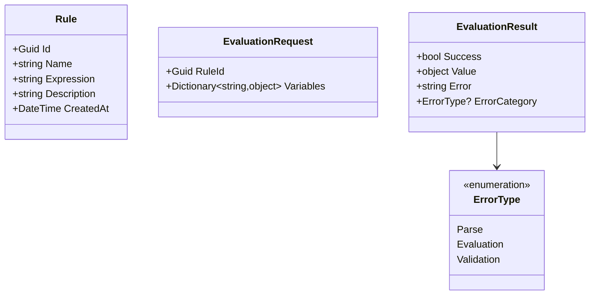

# Rules Engine Service

> Dynamic business rule evaluation via compiled LINQ expressions with SQL injection guards, safe type restrictions, and structured error reporting.

## High-Level Design

```mermaid
graph LR
    Client -->|POST /api/rules/evaluate| API[Rules API]
    API --> Validator[Expression Validator]
    Validator -->|ForbiddenTokens check| Guard[SQL Injection Guard]
    Validator -->|Type check| SafeTypes[SafeTypeProvider]
    Guard --> Transformer[Expression Transformer]
    Transformer -->|AND/OR/NOT to &&/||/!| Compiler[LINQ Compiler]
    Compiler --> Result[Evaluation Result]
    Admin -->|CRUD| API
    API --> DB[(Rules DB)]
```

## Features

- Dynamic business rule evaluation via LINQ expression compilation
- SQL injection guard with ForbiddenTokens whitelist
- Safe type provider restricts evaluation to primitives only
- Expression transformation (AND/OR/NOT to &&/||/!)
- Variable substitution at evaluation time
- Evaluation trace logging for debugging
- Structured error reporting (parse vs evaluation vs validation errors)

## API Endpoints

| Method | Path | Auth | Description |
|--------|------|------|-------------|
| POST | /api/rules/evaluate | Yes | Evaluate a rule with provided variables |
| GET | /api/rules | Yes | List all rules |
| GET | /api/rules/{id} | Yes | Get a specific rule |
| POST | /api/rules | Admin | Create a new rule |
| PUT | /api/rules/{id} | Admin | Update an existing rule |
| DELETE | /api/rules/{id} | Admin | Delete a rule |

## Domain Model



## Edge Cases & Hard Problems Solved

- ForbiddenTokens blocks dangerous SQL keywords: --, ;, DROP, DELETE, INSERT, UPDATE, EXEC, EXECUTE, SELECT, UNION, xp_, sp_, CAST(, CONVERT(, CHAR(, NCHAR(, VARCHAR(, DECLARE
- SafeTypeProvider restricts evaluation to: int, long, float, double, decimal, bool, string, DateTime, DateTimeOffset, Guid, object
- Whole-word boundary checking prevents false positives (e.g., "andalso" does not trigger AND block)
- 4000 character expression limit prevents resource exhaustion from oversized expressions
- Expression transformation handles natural-language operators (AND/OR/NOT) converting to C# equivalents

## Non-Functional Requirements

| Requirement | How Achieved |
|-------------|--------------|
| Sub-ms evaluation | Compiled LINQ expressions |
| SQL injection prevention | ForbiddenTokens whitelist + whole-word boundary matching |
| Type safety | SafeTypeProvider restricts to primitives |
| Resource protection | 4000 char expression limit |
| Structured errors | Categorized as Parse, Evaluation, or Validation |
| Debuggability | Evaluation trace logging |
