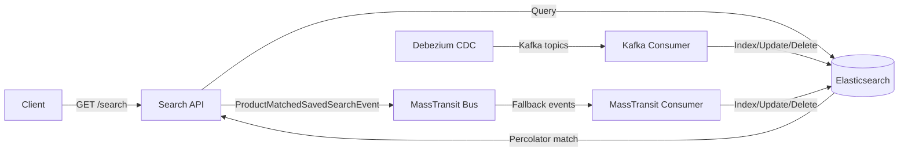
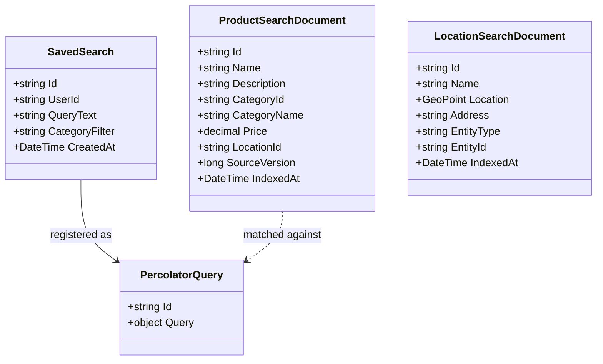

# Search Service

> Real-time full-text search with CDC-driven indexing, fuzzy matching, and reverse-search notifications via Elasticsearch Percolator.

## High-Level Design

## Features

- Full-text search with fuzzy matching powered by Elasticsearch
- Category-weighted scoring (name^3, category^2, description^1)
- Saved searches via Elasticsearch Percolator (reverse search — products find users)
- CDC via Kafka/Debezium with MassTransit fallback (dual-path indexing)
- Out-of-order event suppression using SourceVersion comparison
- Batch denormalization on category rename (1000-document pages)
- Freshness ranking using IndexedAt epoch

## API Endpoints

| Method | Path | Auth | Description |
|--------|------|------|-------------|
| GET | /search?q=&categoryId=&page=&pageSize= | No | Full-text search with optional category filter and pagination |
| POST | /search/saved | Yes | Register a saved search (Percolator query) for reverse matching |

## Events

### Published

| Event | Trigger | Consumers |
|-------|---------|-----------|
| ProductMatchedSavedSearchEvent | New/updated product matches a Percolator saved search | Notifications service (alerts user) |

### Consumed

| Event | Source | Action |
|-------|--------|--------|
| ProductCacheInvalidatedEvent | Catalog service (MassTransit) | Index, update, or delete product; run percolation |
| CategoryUpdatedEvent | Catalog service | Batch re-denormalize all products in renamed category |
| LocationUpdatedEvent | Location service | Update location-enriched fields in index |
| db.catalog.public.products (CDC) | Debezium/Kafka | Primary real-time index sync |
| db.catalog.public.categories (CDC) | Debezium/Kafka | Category metadata sync |

## Domain Model

## Edge Cases & Hard Problems Solved

- **SourceVersion out-of-order suppression**: Each indexed document carries a monotonically increasing SourceVersion; incoming events with a version less than or equal to the current indexed version are discarded, preventing stale overwrites.
- **Category rename batch re-denormalization**: When a category name changes, a scroll query pages through all affected documents (1000 per page) and bulk-updates the denormalized category name.
- **Percolator reverse matching**: New or updated products are percolated against all saved searches; matches publish `ProductMatchedSavedSearchEvent` so users are notified of relevant new inventory.
- **Graceful 404 handling**: If the Catalog API returns 404 during enrichment (product deleted between event emission and consumption), the consumer deletes the search document rather than failing.
- **Kafka CDC snapshot handling**: Debezium "r" (snapshot read) operations are mapped as "created" events, ensuring initial full-load documents are indexed correctly without requiring special-case logic downstream.
- **Category rename denormalization pagination**: Batch re-denormalization paginates 1000 documents at a time to avoid OOM when categories contain large numbers of products.
- **Dual CDC path**: Kafka/Debezium is the primary real-time path; MassTransit event consumers serve as a fallback ensuring indexing even if Kafka is degraded.

## Non-Functional Requirements

| Requirement | How Achieved |
|-------------|--------------|
| Sub-100 ms search latency | Elasticsearch with optimized mappings and category-weighted scoring |
| Real-time indexing | CDC via Debezium + event-driven MassTransit fallback |
| Zero data loss on out-of-order events | SourceVersion comparison suppresses stale writes |
| Eventual consistency with freshness signal | IndexedAt epoch allows clients to assess document freshness |
| Horizontal scalability | Stateless API nodes; Elasticsearch handles shard distribution |
| Resilient to upstream failures | Dual CDC path ensures indexing continuity |
